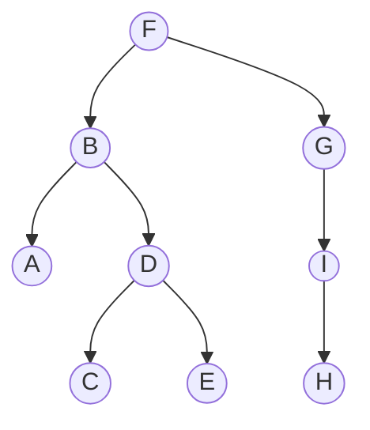

# ALGORYTMY I STRUKTURY DANYCH

## Szacowanie złożoności algorytmów, klasy złożoności problemów algorytmicznych

### Dobry algorytm

-   Poprawny
-   Zwraca prawidłowy wynik
-   Wydajny
    -   Zużywa minimalne zasoby
    -   Wykonuje jak najmniejszą ilość pracy oraz pamięć
-   Szybki
    -   Niezależny od środowiska
    -   Niezależny od danych wejściowych

### Analiza złożoności

-   Wyznaczenie zbioru operacji dominujących.
-   Wyznaczenie funkcji argumentów (danych wejściowych), które stanowią rozmiar danych, czyli to co wpływa na ilość pracy algorytmu.

### Operacja dominująca

-   Pokrywa proporcjonalnie pracę całego algorytmu.
-   Zbiór operacji dominujących jest zbiorem operacji, których liczba jest proporcjonalna do liczby wszystkich operacji wykonanych przez algorytm.
-   Pętle i instrukcje warunkowe powinny je zawierać, bo nie jest to jednokrotnie wykonany kod.

### Złożoność czasowa

-   Liczba operacji dominujących wykonanych przez algorytm jako funkcja rozmiaru danych
-   Ilość pracy wykonana przez algorytm w zależności od wielkości danych

#### Rodzaje złożoności czasowej

-   **Optymistyczna**: Liczba wykonanych operacji dominujących w najlepszym przypadku.
-   **Pesymistyczna**: Liczba wykonanych operacji dominujących w najgorszym przypadku.
-   **Przeciętna**: Przeciętny czas wykonanych operacji dominujących dla modelu o losowych danych wejściowych.

### Złożoność pamięciowa

Liczba jednostek pamięci zużytej przez algorytm jako funkcja rozmiaru danych.

### Notacja asymptotyczna

Pominięcie stałych i nieistotnych detali. Wyraża funkcję złożoności algorytmu oraz tempo jego wzrostu.

-   $O(n)$:
    -   Górne ograniczenie tempa wzrostu danej funkcji.
    -   $f(n) = O(g(n))$ - funkcja $g(n)$ jest ograniczeniem górnym rzędu wielkości funkcji $f(n)$.
-   $\Theta(n)$:
    -   Dokładnie ten sam rząd funkcji co inna funkcja.
    -   $f(n) = \Theta(g(n))$ - funkcja $g(n)$ ma ten sam rząd wielkości co funkcja $f(n)$.
-   $\Omega(n)$:
    -   Dolne ograniczenie tempa wzrostu danej funkcji.
    -   $f(n) = \Omega(g(n))$ - funkcja $g(n)$ jest ograniczeniem dolnym rzędu wielkości funkcji $f(n)$.
-   $o(n)$:
    -   Ograniczenie górne ostre.
-   $\omega(n)$:
    -   Ograniczenie dolne ostre.
-   $\log_{a}{n}$ jest ostro niższy od dowolnej funkcji potęgowej $n^b$.
-   Funkcje wykładnicze $a^n$ mają inne rzędy wielkości w zależności od podstawy $a$.
-   Każda funkcja wykładnicza $a^n$ (dla dowolnego $a$ dodatniego rzeczywistego) ma rząd ostro większy od każdej funkcji potęgowej $n^b$.

#### Standardowe oszacowania złożoności obliczeniowej

| Notacja        | Rząd złożoności                 |
| -------------- | ------------------------------- |
| $O(1)$         | złożoność stała                 |
| $O(\log{n})$   | złożoność logarytmiczna         |
| $O(n)$         | złożoność liniowa               |
| $O(n \log{n})$ | złożoność liniowo-logarytmiczna |
| $O(n^2)$       | złożoność kwadratowa            |
| $O(n^k)$       | złożoność wielomianowa          |
| $O(2^n)$       | złożoność wykładnicza           |
| $O(n!)$        | silnia                          |

## Najważniejsze algorytmy wyszukiwania i sortowania, przegląd i zastosowania

### Wyszukiwanie

-   Input: ciąg liczb całkowitych, długość ciągu, klucz.
-   Output: indeks - liczba naturalna mniejsza od długości ciągu, pod którym znajduje się klucz albo -1 w przypadku nieobecnego klucza.
-   Rozmiarem danych jest rozmiar ciągu.
-   Operacją dominującą jest porównanie.
-   Elementy są przeważnie indeksowane od 0 do długości ciągu ekskluzywnie.
-   Złożoność pesymistyczna może się wydarzyć, gdy klucz jest ostatnim elementem.

#### Bardziej efektywny algorytm wyszukiwania

-   Input: ciąg liczb całkowitych posortowanych niemalejąco, długość ciągu, klucz.
-   Output: indeks - liczba naturalna mniejsza od długości ciągu, pod którym znajduje się klucz albo -1 w przypadku nieobecnego klucza.

#### Wyszukiwanie liniowe

Przeszukujemy wszystkie indeksy od `0` do `len - 1`.

```python
def linear_search(array, key):
    for i in range(0, len(array)):
        if array[i] == key:
            return i

    return -1
```

Złożoność pamięciowa: $O(1)$

|               | Złożoność czasowa |
| ------------- | ----------------- |
| Pesymistyczna | $O(n)$            |
| Optymistyczna | $O(1)$            |
| Przeciętna    | $O(\frac{n}{2})$  |

#### Skok co k

Jest k razy szybszy niż wyszukiwanie liniowe.

-   Porównaj element do klucza co k skoków.
-   Jeśli k-ty element jest większy od klucza:
    -   Sprawdź ostatnie k-1 przeskoczonych elementów.
-   Jeśli wśród k-1 elementów nie było elementu:
    -   Klucz nie jest obecny w ciągu, zwróć -1.

```python
def jump_search(arr, key):
    size = len(arr)
    block_size = sqrt(size)

    index = 0
    while arr[trunc(min(block_size, size) - 1)] < key:
        index = block_size
        block_size += sqrt(size)

        if index >= size:
            return -1

    while arr[trunc(index)] < key:
        index += 1

        if index == min(block_size, size):
            return -1

    if arr[int(index)] == key:
        return trunc(index)

    return -1
```

Złożoność pamięciowa: $O(1)$

|               | Złożoność czasowa |
| ------------- | ----------------- |
| Pesymistyczna | $O(\sqrt{n})$     |
| Optymistyczna | $O(1)$            |
| Przeciętna    | $O(\sqrt{n})$     |

#### Wyszukiwanie binarne

Z każdą iteracją ciąg jest 2 razy krótszy. Algorytm zatrzyma się jak długość bieżącego podciągu nie będzie dodatnia albo jeśli wcześniej znajdziemy element.

-   Póki długość podciągu jest dodatnia:
    -   Porównaj klucz ze środkowym elementem.
    -   Jeśli zachodzi równość:
        -   Zwróć indeks środkowego elementu.
    -   Jeśli klucz jest mniejszy niż element:
        -   Wyszukaj podciąg na lewo od indeksu bieżącego elementu.
    -   Jeśli klucz jest większy niż element:
        -   Wyszukaj podciąg na prawo od indeksu bieżącego elementu.
-   Jeśli długość podciągu nie jest dodatnia:
    -   Klucz nie jest obecny w ciągu, zwróć -1.

```python
def binary_search(array, key, left=0, right=None):
    if right is None:
        right = len(array) - 1

    while left <= right:
        mid = (left + right) // 2

        if key == array[mid]:
            return mid
        elif key < array[mid]:
            right = mid - 1
        else:
            left = mid + 1

    return -1
```

Złożoność pamięciowa: $O(1)$

|               | Złożoność czasowa |
| ------------- | ----------------- |
| Pesymistyczna | $O(\log{n})$      |
| Optymistyczna | $O(1)$            |
| Przeciętna    | $O(\log{n})$      |

#### k-ta statystyka pozycyjna

-   $k$-ty najmniejszy/największy element w danym ciągu.
-   W przypadku posortowanego ciągu, $k$-ta pozycja jest wynikiem.

#### Algorytm turniejowy

-   Szukany jest drugi najmniejszy element.
-   Liczby porównujemy w parach i wybierany jest mniejszy element dopóki nie znajdziemy najmniejszego elementu.
-   Porównań jest $n - 1$.
-   Jeśli drzewo binarne ma $n$ liści, to jego wysokość ma przeciętnie $\log{n}$.
-   Możemy znaleźć drugi najmniejszy element poprzez porównanie elementów, z którym był porównywany najmniejszy, a było ich $\log{n}$.

### Sortowanie

-   Input: ciąg elementów, długość ciągu.
-   Output: ciąg posortowany niemalejąco składający się z tych samych elementów.

#### Zastosowanie

-   Przyspieszenie wyszukiwania
-   Przyspieszenie operacji na danych
-   Wizualizacja danych
-   Obliczanie statystyk

#### Stabilność algorytmu sortującego

-   Zachowanie pierwotnego porządku względem elementów o tej samej wartości.
-   Istotna cecha przy sortowaniu względem rekordów o wielu atrybutach, a sortując po kolejnym atrybucie nie niszczymy wyników sortowania po poprzednim.

#### Selection sort

Jest to bardzo wolny algorytm, a jego złożoność się nie zmienia nawet przy posortowanym ciągu. Dochodzi do $\frac{(n \cdot (n - 1))}{2}$ porównań.

-   Póki indeks jest mniejszy od długości ciągu:
    -   W sortowanym podciągu szukaj minimum.
    -   Jeśli znalezione minimum jest mniejsze od pierwszego elementu podciągu:
        -   Zamień go z pierwszym elementem podciągu.
    -   Kontynuuj sortowanie począwszy od drugiego elementu.

```python
def selection_sort(array):
    for i in range(len(array)):
        current_min = i

        for current_index in range(i + 1, len(array)):
            if array[current_index] < array[current_min]:
                current_min = current_index

        if current_min != i:
            array[i], array[current_min] = array[current_min], array[i]

    return array
```

Złożoność pamięciowa: $O(1)$

|               | Złożoność czasowa |
| ------------- | ----------------- |
| Pesymistyczna | $O(n^2)$          |
| Optymistyczna | $O(n^2)$          |
| Przeciętna    | $O(n^2)$          |

#### Insertion sort

W najlepszym przypadku przy posortowanym ciągu jest $n - 1$ porównań i czas zamiany elementów będzie stały $O(1)$. W najgorszym przypadku jak ciąg jest odwrotnie posortowany, to będzie $O(n^2)$ porównań, czyli tak jak w przypadku selection sort. Sortowanie jest dostosowane do wcześniej posortowanych elementów.

-   Iteruj od indeksu drugiego elementu:
    -   Póki nie przekroczyliśmy indeks pierwszego elementu oraz obecny element jest mniejszy niż element na obecnie analizowanym indeksie:
        -   Zamień obecny element z poprzednim.
        -   Analizuj poprzedni indeks.
    -   Zamieniamy element na analizowanym indeksie z elementem początkowo przypisanym indeksie w podciągu.

```python
def insertion_sort(array):
    for i in range(1, len(array)):
        current, current_index = array[i], i

        while current_index > 0 and current < array[current_index - 1]:
            array[current_index] = array[current_index - 1]
            current_index -= 1

        array[current_index] = current

    return array
```

Złożoność pamięciowa: $O(1)$

|               | Złożoność czasowa |
| ------------- | ----------------- |
| Pesymistyczna | $O(n^2)$          |
| Optymistyczna | $O(n)$            |
| Przeciętna    | $O(n^2)$          |

#### Merge sort

Na każdym łączeniu ciągów jest mniej więcej tyle porównań co długość ciągu. Ilość łączeń jest log2(n) - z każdym łączeniem jest o połowę mniej elementów. Tworzymy tablicę na alokację podciągów i złożoność jest niestety wysoka, bo potrzebujemy tyle pamięci ile elementów jest w ciągu oraz rekursję. Możemy uniknąć redundantnej alokacji pamięci za pomocą list dowiązaniowych poprzez zmianę wskaźników dowiązań zamiast tworzenia dodatkowych tablic.

-   Póki długość ciągu jest większa od 1:
    -   Podziel ciąg na 2 połowy.
    -   Posortuj każdą połowę.
    -   Zwróć połączone posortowane połówki w ciągu.
-   Inaczej zwróć ciąg.

```python
def merge_sort(array):
    if len(array) <= 1:
        return array

    mid = len(array) // 2

    left = merge_sort(array[:mid])
    right = merge_sort(array[mid:])

    return merge(left, right)


def merge(left, right):
    left_index, right_index = 0, 0
    merged = []

    while left_index < len(left) and right_index < len(right):
        if left[left_index] < right[right_index]:
            merged.append(left[left_index])
            left_index += 1
        else:
            merged.append(right[right_index])
            right_index += 1

    merged += left[left_index:]
    merged += right[right_index:]

    return merged
```

Złożoność pamięciowa: $O(n)$

|               | Złożoność czasowa |
| ------------- | ----------------- |
| Pesymistyczna | $O(n \log{n})$    |
| Optymistyczna | $O(n \log{n})$    |
| Przeciętna    | $O(n \log{n})$    |

#### Quick sort

Operacją dominującą jest porównanie 2 elementów ciągu, a rozmiarem danych jest długość ciągu. Jeśli pivot będzie skrajnym elementem, wtedy ciąg na lewo lub prawo będzie pusty, więc nie wykona się rekursja, co skutkuje to kwadratową złożonością czasową. Danymi wejściowymi jest ciąg, lewy indeks posortowanego podciągu oraz prawy indeks posortowanego podciągu.

-   Jeśli sortowany ciąg ma długość niewiększą niż 1 - zakończ rekursję.
-   Jeśli ciąg jest dłuższy wykonaj `partition`:
    -   Jako dane wejściowe mamy nieposortowaną tablicę, skrajny lewy oraz prawy element podciągu.
    -   Wybierz losowy element - umownie pierwszy.
    -   Względem wybranego elementu sortuj ciąg tak, że na wyjściu mamy z lewej elementy mniejsze od wybranego elementu, a z prawej większe.
    -   Zwróć indeks, na którym znalazł się wybrany element.
-   Wykonaj rekurencyjnie `quick_sort` na podciągach elementów na lewo od zwróconego indeksu z `partition` i na prawo od tego indeksu.

```python
def quick_sort(array, left=0, right=None):
    if right is None:
        right = len(array) - 1

    if left >= right:
        return

    pivot = partition(array, left, right)

    quick_sort(array, left, pivot - 1)
    quick_sort(array, pivot + 1, right)

    return array
```

Złożoność pamięciowa: $O(n)$

|               | Złożoność czasowa |
| ------------- | ----------------- |
| Pesymistyczna | $O(n^2)$          |
| Optymistyczna | $O(n \log{n})$    |
| Przeciętna    | $O(n \log{n})$    |

#### Partition

Porównanie robimy dla każdego elementu ciągu poza pivotem - długość ciągu - 1. Podobnie jak dla `merge_sort`, argumentami są ciąg, lewy indeks podciągu oraz prawy indeks podciągu. Zwracany jest indeks pivota.

-   Póki indeksy się nie spotkają:
    -   Lewy indeks przesuwa się na prawo póki nie spotka liczby większej od pivota.
    -   Indeks prawy na lewo póki nie spotka liczby mniejszej od pivota.
    -   W tym wypadku liczby zamieniają się miejscami.
-   Pivot zamieniamy z ostatnim elementem lewego ciągu - miejscem spotkania się indeksów.

```python
def partition(array, left, right):
    i = left + 1
    j = right
    pivot = array[left]

    while i < j:
        while i < right and array[i] <= pivot:
            i += 1
        while j > i and array[j] >= pivot:
            j -= 1

        if i < j:
            array[i], array[j] = array[j], array[i]

    if array[i] > pivot:
        array[left], array[i - 1] = array[i - 1], pivot

        return i - 1
    else:
        array[left], array[i] = array[i], pivot

        return i
```

Złożoność pamięciowa: $O(1)$

|               | Złożoność czasowa |
| ------------- | ----------------- |
| Pesymistyczna | $O(n)$            |
| Optymistyczna | $O(n)$            |
| Przeciętna    | $O(n)$            |

## Charakterystyka i zastosowania podstawowych struktur danych: stos, kolejka, kolejka priorytetowa, struktura Find-Union, słownik

Abstrakcyjna struktura danych to zestaw operacji, które można wykonać na danych. Enkapsulacja implementacji odbywa się za pomocą konkretnych struktur danych np. listy, drzewa, tablice etc. Ukrywając tę implementację
eksponuje się jedynie interfejs metod.

### Stos

Last in, first out - zdejmujemy ze stosu elementy w odwrotnej kolejności w jakiej były dodane, czyli zdejmujemy zawsze ostatnio dodany.

#### Interfejs

-   `push(value)` - dodaj do stosu element value
-   `pop()` - zdejmij i zwróć ostatnio dodany element
-   `peek()` - zwróć bez zdejmowania ostatni element

```python
class Stack:
    def __init__(self, top=None):
        self.top = top

    def push(self, value):
        if self.top is None:
            self.top = Node(value)
        else:
            pushed = Node(value)
            pushed.next, self.top = self.top, pushed

    def pop(self):
        if self.top is None:
            return
        else:
            popped, self.top = self.top, self.top.next
            popped.next = None

            return popped.value

    def peek(self):
        if self.top is None:
            return
        else:
            return self.top.value
```

Złożoność pamięciowa: $O(n)$

| Operacja | Złożoność czasowa |
| -------- | ----------------- |
| Access   | $O(n)$            |
| Search   | $O(n)$            |
| Insert   | $O(1)$            |
| Delete   | $O(1)$            |

### Kolejka

First in, first out - elementy zdejmujemy w tej samej kolejności w jakiej były dodane, czyli zawsze przy zdejmowaniu zwracamy pierwszy element kolejki.

#### Interfejs

-   `enqueue(value)` - dodaj element value na koniec kolejki
-   `dequeue()` - zdejmij i zwróć element najdawniej dodany do kolejki
-   `peek()` - zwróć bez zdejmowania najdawniej dodany element

```python
class Queue:
    def __init__(self, front=None):
        self.front = self.back = front

    def enqueue(self, value):
        enqueued = Node(value)

        if self.front is None:
            self.front = self.back = enqueued
        else:
            self.back.next, self.back = enqueued, enqueued

    def dequeue(self):
        if self.front is None:
            return
        else:
            dequeued, self.front = self.front, self.front.next
            dequeued.next = None

            if self.front is None:
                self.back = None

            return dequeued.value

    def peek(self):
        if self.front is None:
            return
        else:
            return self.front.value
```

Złożoność pamięciowa: $O(n)$

| Operacja | Złożoność czasowa |
| -------- | ----------------- |
| Access   | $O(n)$            |
| Search   | $O(n)$            |
| Insert   | $O(1)$            |
| Delete   | $O(1)$            |

### Kolejka priorytetowa

Abstrakcyjna struktura do przetwarzania elementów z przypisanymi priorytetami o numerach całkowitych.

Im niższy numer, tym wyższy priorytet albo odwrotnie - zależy od konwencji. Rozwiązanie za pomocą list i tablic jest naiwne i nieefektywne. W przypadku naiwnej implementacji posortowanej kolejki czas wstawiania jest liniowy, reszta ma czas stały.

#### Interfejs

-   `insert(priority, value)` - dodaj element o danym priorytecie
-   `find_min()` - zwróć bez zdejmowania element o najniższym priorytecie
-   `delete_min()` - zdejmij i zwróć element o najniższym priorytecie

```python
class PriorityQueue:
    def __init__(self):
        self.priority_queue = []

    def insert(self, priority, value=None):
        self.priority_queue.append((priority, value))

    def find_min(self):
        if len(self.priority_queue) == 0:
            return

        min, min_priority = self.priority_queue[0], self.priority_queue[0][0]

        for item in self.priority_queue:
            priority = item[0]

            if priority < min_priority:
                min, min_priority = item, priority

        return min

    def delete_min(self):
        if len(self.priority_queue) == 0:
            return

        min = self.find_min()
        self.priority_queue.remove(min)

        return min
```

Złożoność pamięciowa: $O(n)$

| Operacja | Złożoność czasowa |
| -------- | ----------------- |
| Access   | $O(n)$            |
| Search   | $O(n)$            |
| Insert   | $O(1)$            |
| Delete   | $O(n)$            |

### Słownik

Abstrakcyjna struktura danych operująca na parach key-value.

#### Implementacje

1. Tablice mieszające

    - Są efektywną implementacją słowników
    - Nie zapewniają implementacji wyższej niż liniowa niektórych operacji niż jak w przypadku słownika uporządkowanego

2. Drzewo BST jest najprostszą implementacją słownika uporządkowanego

    - Zapewnia efektywną przeciętną złożoność czasową operacji słownika uporządkowanego
    - Pesymistyczna złożoność czasowa jest liniowa

3. Drzewo AVL

    - Rozszerzenie BST o warunek zrównoważenia
    - Zapewnia logarytmiczną złożoność czasową w pesymistycznym przypadku

#### Interfejs

-   `search(key)` - zwróć wartość związaną z kluczem key
-   `insert(key, value)` - wstaw parę key-value do słownika
-   `delete(key)` - usuń parę o kluczu key

Złożoność pamięciowa: $O(n)$

#### Złożoność czasowa dla nieposortowanych kluczy

| Operacja | Złożoność czasowa |
| -------- | ----------------- |
| Search   | $O(n)$            |
| Insert   | $O(1)$            |
| Delete   | $O(n)$            |

#### Złożoność czasowa dla posortowanych kluczy

| Operacja | Złożoność czasowa |
| -------- | ----------------- |
| Search   | $O(\log{n})$      |
| Insert   | $O(n)$            |
| Delete   | $O(n)$            |

#### Problem adresowania bezpośredniego

-   Może być zaimplementowana za pomocą tablicy
-   `search` ma czas stały
-   Niestety zajmuje tyle pamięci ile największa wartość klucza, nie liczby kluczy
-   Działa dla kluczy, które są liczbą naturalną
-   Lepszym pomysłem jest hash table

#### Tablica mieszająca

-   Rozszerzamy adresowanie bezpośrednie o dodatkowy krok:

    -   Wartość indeksu klucza w tablicy wylicza się funkcją mieszającą:
        -   `hash`: $U \rightarrow [0 \ldots n - 1]$
    -   Ilość zużytej pamięci jest proporcjonalna do parametru $n$, a nie rozmiaru uniwersum $U$.
    -   Typ klucza jest dowolny - typ argumentu funkcji mieszającej.

-   Kolizja może wyniknąć, bo $n$ ma na ogół niższy rozmiar niż uniwersum $U$ i funkcja mieszająca nie jest różnowartościowa.

    -   Mieszanie wielokrotne:
        -   Wtedy w tablicy możemy przechować maksymalnie m elementów.
        -   Powtarzamy mieszanie póki nie znajdziemy wolne miejsce.
    -   Metoda łańcuchowa:
        -   Dla każdego elementu tablicy mamy listę dowiązaniową.
        -   Może być przeszukana liniowo.
        -   Można umieścić na każdym miejscu więcej niż jeden element.

##### Własność funkcji mieszającej

-   Musi być szybka, a najlepiej działać w czasie stałym.
-   Dla wylosowanego klucza w uniwersum każda wartość z zakresu tablicy musi być prawdopodobna.

##### Hash table jako implementacja słownika

-   Efektywne rozwiązanie jeśli mamy równomiernie rozłożone obciążenie.
-   Parametr w funkcji mieszającej im wyższy, tym niższa przeciętna złożoność czasowa, ale wyższe zużycie pamięci.
-   Jeśli mamy klucze uporządkowane - przydatne są operacje oparte na porządku kluczy np. znajdź minimalny, maksymalny, poprzedni, następny klucz do podanego.

### Struktura Union-Find

Struktura Union-Find znajduje szerokie zastosowanie w algorytmach grafowych, w problemach segmentacji obrazów oraz w wielu innych dziedzinach, gdzie potrzebne jest zarządzanie rozłącznymi zbiorami.

Najczęściej struktura Union-Find jest reprezentowana za pomocą tablicy (lub lasu) "parent", gdzie dla danego indeksu `i`, wartość `parent[i]` wskazuje na "przodka" zbioru, do którego należy i. Jeśli `parent[i]` jest równe `i`, oznacza to, że `i` jest korzeniem drzewa `i` jest "przywódcą" swojego zbioru.

Struktura Union-Find dostarcza głównie dwóch operacji:

1. `find(x)` - określa, do którego podzbioru należy dany element

-   Jeśli `parent[x]` jest równe `x`, zwróć `x` (ponieważ `x` jest korzeniem swojego zbioru).
-   W przeciwnym razie wywołaj rekursywnie `find` na `parent[x]` i zwróć jego wynik.
-   Aby zoptymalizować strukturę, często stosuje się technikę "ścieżki kompresji", która podczas rekursji aktualizuje parent[x] do korzenia zbioru.

2. `union(x, y)` - łączy dwa podzbiory w jeden

-   Znajdź korzenie zbiorów, do których należą `x` i `y`, używając operacji `find`.
-   Jeśli korzenie są różne, połącz dwa drzewa, ustawiając jedno drzewo jako poddrzewo drugiego. Często stosuje się tutaj technikę "union by rank" - drzewo o niższej wysokości dodaje się jako poddrzewo drzewa o większej wysokości, co pomaga w zachowaniu zrównoważonej struktury.

## Drzewa binarne i drzewa n-arne w algorytmice. Charakterystyka, sposoby implementacji i zastosowania

Drzewem jest graf spójny i acykliczny. Każde dwa wierzchołki są połączone dokładnie jedną drogą elementarną, dodanie jakiejkolwiek krawędzi spowoduje powstanie dokładnie jednego nowego cyklu. Ogólnie drzewa są podstawową strukturą danych w informatyce i algorytmice, używaną w wielu różnorodnych aplikacjach, od przetwarzania tekstu, przez grafikę komputerową, aż po systemy baz danych. W zależności od konkretnego zastosowania wybierane są odpowiednie typy drzew, które najlepiej odpowiadają potrzebom danego problemu.

### Drzewa binarne

#### Charakterystyka

-   Drzewo binarne to drzewo, w którym każdy węzeł ma co najwyżej dwoje dzieci.
-   Można wyróżnić różne typy drzew binarnych, takie jak:
    -   Drzewo binarne pełne: każdy węzeł ma albo 0, albo 2 dzieci.
    -   Drzewo binarne zupełne: wszystkie poziomy są w pełni wypełnione, z wyjątkiem ostatniego, który może być wypełniony od lewej.
    -   Drzewo binarne zrównoważone: różnica między wysokościami lewego i prawego poddrzewa każdego węzła wynosi co najwyżej 1.

#### Sposoby implementacji

-   **Tablica**: Drzewa binarne zupełne mogą być skutecznie reprezentowane za pomocą tablicy, gdzie dla węzła o indeksie `i`, lewe dziecko ma indeks `2i+1`, a prawe `2i+2`.
-   **Struktury**: Typowo drzewo binarne reprezentowane jest za pomocą struktury lub klasy, która posiada wskaźniki (lub referencje) do lewego i prawego dziecka.

#### Zastosowania

-   **Drzewa binarne poszukiwań (BST)**: Umożliwiają szybkie dodawanie, usuwanie i wyszukiwanie elementów.
-   **Drzewa Huffmana**: Stosowane w kompresji danych.
-   **Drzewa przeszukiwania**: Przeglądanie danych w konkretnym porządku (pre-order, in-order, post-order).

### Drzewa n-arne (n-ary)

#### Charakterystyka

-   Drzewo n-arne to drzewo, w którym każdy węzeł ma co najwyżej $n$ dzieci.
-   Specjalnym przypadkiem jest drzewo binarne, gdzie $n = 2$.

#### Sposoby implementacji

-   **Lista dzieci**: Każdy węzeł zawiera listę wskaźników do swoich dzieci.
-   **Lewy syn - prawy brat**: Każdy węzeł wskazuje na swój "pierwszy" (czyli lewy) syn oraz na "następnego" brata. Dzięki temu, zachowując tylko dwa wskaźniki w każdym węźle, możemy reprezentować drzewa n-arne.

#### Zastosowania

-   **Struktury hierarchiczne**: Na przykład reprezentacja struktury folderów na dysku.
-   **Drzewa decyzyjne**: W sztucznej inteligencji, do reprezentacji możliwych ścieżek decyzji.
-   **Drzewa składniowe**: W kompilatorach, do reprezentacji struktury programów.

### Algorytmy przeszukiwania drzew

#### Rekurencyjne przeszukiwanie drzew binarnych

Odwiedzamy każdy wierzchołek i krawędź dokładnie raz. Zaczynamy zawsze od korzenia i rekurencyjnie przeszukujemy w poddrzewie lewym, a w następnej kolejności w prawym. Oprócz porządku standardowego dla dowolnych drzew uporządkowanych są 3 specyficzne porządki rekurencyjnego przeglądania drzewa binarnego:

-   **Pre-order** (bieżący, lewy, prawy):
    -   Wypisz wierzchołek od razu na wejściu.
-   **In-order** (lewy, bieżący, prawy):
    -   Wypisz wierzchołek lewego syna na drugim wejściu wierzchołka.
    -   Każdy inny na pierwszym wejściu.
-   **Post-order** (lewy, prawy, bieżący):
    -   Wypisz wierzchołek przy ostatnim wejściu.

##### Zastosowania w obliczeniach

-   Liczba wierzchołków drzewa
-   Wysokość drzewa
-   Głębokość wierzchołka
-   Liczba liści

##### Ogólny schemat

-   Umieść startowy wierzchołek w strukturze danych $x$.
-   Wyjmij kolejny wierzchołek $v$ ze struktury $x$ i odwiedź go.
-   Włóż do $x$ kolejno wszystkich nieodwiedzonych sąsiadów $v$.

##### Warianty przeszukiwania

-   Wybór struktury danych $x$ np. stos daje DFS albo kolejka daje BFS
-   Wybór kolejności sąsiadów np. alfabetyczne etykiety

##### Klasyfikacja

-   Graf skierowany da nam ukorzenione drzewo przeszukiwań.
-   Graf nieskierowany da nam zbiór drzew poszukiwań, czyli las przeszukiwania dla krawędzi:
    -   **Drzewcowej**: $v$ jest odwiedzony z $u$ w wyniku przejścia $u \rightarrow v$.
    -   **Przedniej**: nie jest drzewowa i $v$ jest potomkiem $u$ w drzewie.
    -   **Tylnej**: nie jest drzewowa i $v$ jest przodkiem $u$ w drzewie.
    -   **Poprzecznej**: w pozostałych przypadkach między gałęziami lub drzewami.



| Algorytm   | Ścieżka                           |
| ---------- | --------------------------------- |
| Pre-order  | F - B - A - D - C - E - G - I - H |
| In-order   | A - B - C - D - E - F - G - H - I |
| Post-order | A - C - E - D - B - H - I - G - F |

#### Breadth-first search

Odwiedzamy wierzchołki równomiernie we wszystkich kierunkach zgodnie z rosnącą odległością od startowego. Można sobie wyobrazić algorytm jak pożar w lesie. Na grafie skierowanym listą sąsiedztwa będą tylko wierzchołki krawędzi wychodzących. Z racji, że przetwarzamy każdy wierzchołek i krawędź, to złożoność czasowa jest proporcjonalna do sumy ilości krawędzi i wierzchołków, zatem jest liniowa.

-   Grafy skierowane:
    -   Nie występują przednie krawędzie
-   Grafy nieskierowane:
    -   Nie występują ani w przód, ani wsteczne krawędzie

Zaczynając od korzenia póki kolejka nie jest pusta:

-   Wyznacz listę sąsiedztwa dla wierzchołka:

    -   Zdejmij z kolejki przetwarzany wierzchołek.
    -   Kolejkuj nieodwiedzone sąsiednie wierzchołki zdjętego wierzchołka.
    -   Dla każdego wierzchołka sąsiedniego zwiększamy dystans od początkowego wierzchołka o jeden.
    -   Przypisz rodzica.

#### Depth-first search

Czas rozpoczęcia przetwarzania jest zawsze mniejszy niż czas zakończenia. Jest to sortowanie topologiczne. Z racji, że przetwarzamy każdy wierzchołek i krawędź, to złożoność czasowa jest proporcjonalna do sumy ilości krawędzi i wierzchołków, zatem jest liniowa.

Zaczynając od korzenia wyznacz listę sąsiedztwa:

-   Analizuj wierzchołki z listy sąsiedztwa:
    -   Wyznacz rodzica.
    -   Czas rozpoczęcia przetwarzania.
    -   Czas zakończenia przetwarzania.
        -   Póki sąsiedni wierzchołek nie jest odwiedzony przetwarzaj sąsiedni wierzchołek:
            -   Dodaj na stos odwiedzony wierzchołek.
            -   Inkrementuj czas rozpoczęcia przetwarzania.
        -   Zdejmij ze stosu i zakończ przetwarzanie obecnego wierzchołka.
        -   Inkrementuj czas przetwarzania i zapisz jako czas zakończenia.
        -   Cofnij się do rodzica.

## Algorytmy rekurencyjne vs algorytmy iteracyjne, porównanie i omówienie podstawowych założeń konstrukcyjnych

Rekursja i iteracja to dwa podstawowe podejścia do projektowania algorytmów. Wybór między rekursją a iteracją często zależy od konkretnego problemu, który jest rozwiązywany, oraz od osobistych preferencji programisty. W niektórych językach programowania, takich jak Haskell, rekursja jest bardziej naturalna i jest preferowana. W innych, takich jak C, podejście iteracyjne jest częściej stosowane z powodu wydajności. W praktyce warto znać oba podejścia i umieć je stosować w odpowiednich sytuacjach.

### Algorytmy rekurencyjne

#### Założenia konstrukcyjne

1. **Podział na przypadki bazowe i rekurencyjne**: Każda funkcja rekurencyjna powinna mieć co najmniej jeden przypadek bazowy (warunek zakończenia rekursji) oraz co najmniej jeden przypadek rekurencyjny (w którym funkcja odwołuje się do samej siebie).
2. **Zmniejszenie problemu**: Każde wywołanie rekursyjne powinno dotyczyć mniejszej wersji oryginalnego problemu, aby ostatecznie dotrzeć do przypadku bazowego.

#### Zalety

-   Często bardziej intuicyjne i łatwiejsze do zrozumienia dla niektórych problemów, zwłaszcza tych, które mają naturalną strukturę hierarchiczną lub drzewiastą.
-   Może prowadzić do bardziej zwięzłego i eleganckiego kodu.

#### Wady

-   Największą wadą rekurencji jest duży koszt pamięciowy. Zbyt głęboka rekursja może prowadzić do przekroczenia limitu stosu.
-   Może być mniej wydajne niż odpowiednik iteracyjny z powodu kosztów związanych z wielokrotnym wywoływaniem funkcji.

### Algorytmy iteracyjne

#### Założenia konstrukcyjne

1. **Inicjalizacja**: Zdefiniowanie wartości początkowych dla zmiennych kontrolujących pętlę.
2. **Kontrola pętli**: Warunek, który określa, czy pętla powinna nadal być wykonywana.
3. **Aktualizacja**: Modyfikacja zmiennych kontrolujących pętlę w każdym cyklu iteracyjnym.

#### Zalety

-   Zazwyczaj są bardziej wydajne niż odpowiedniki rekurencyjne z powodu braku dodatkowych kosztów związanych z wywoływaniem funkcji.
-   Nie narażone na ryzyko przekroczenia limitu stosu.

#### Wady

-   Kod może być bardziej złożony i trudniejszy do zrozumienia w przypadku niektórych problemów, które naturalnie nadają się do podejścia rekurencyjnego.
