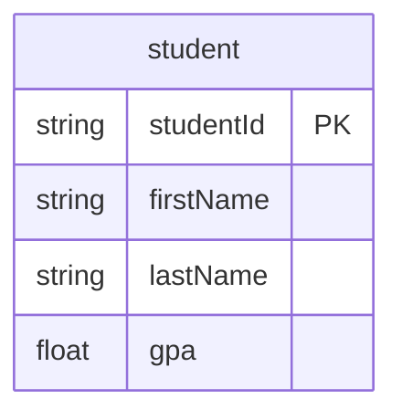
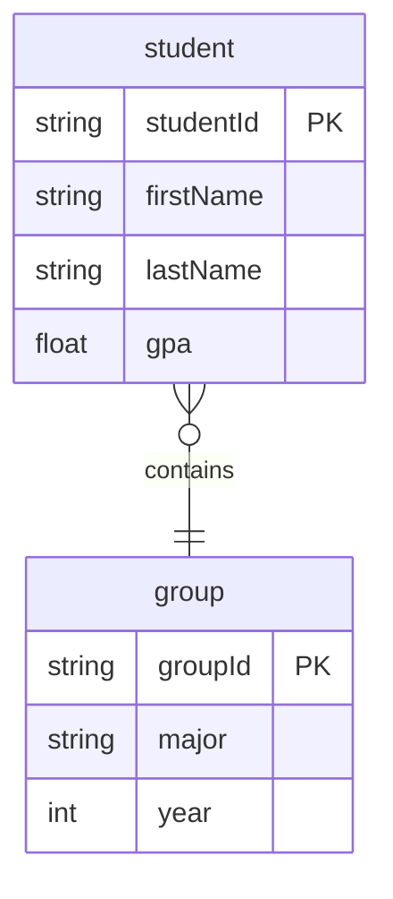
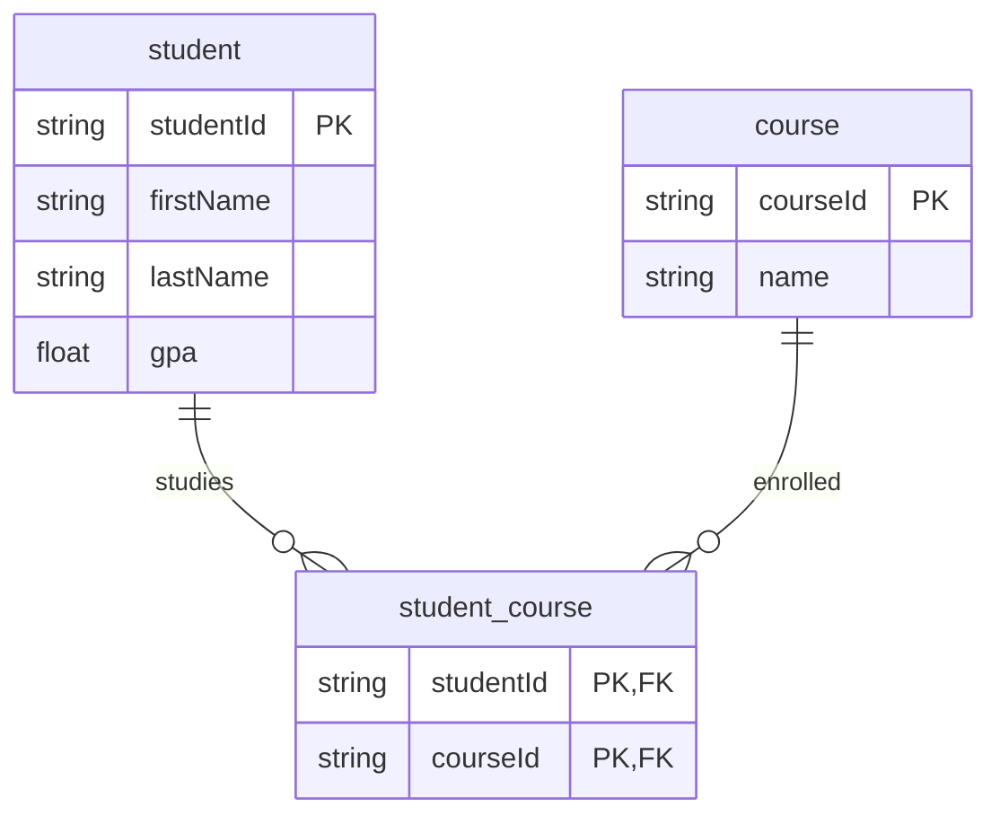
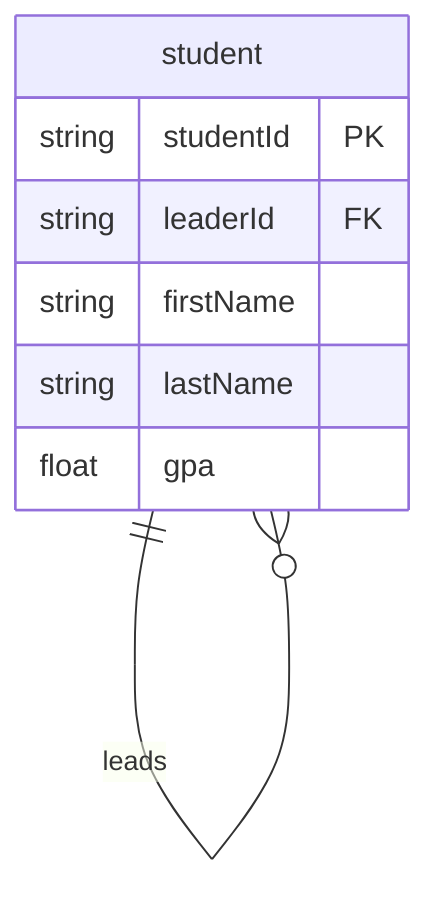
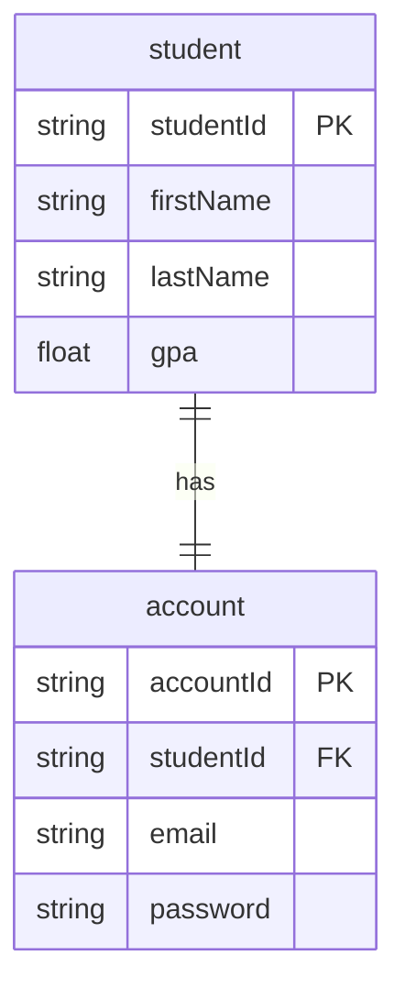

# BAZY DANYCH

## Podstawowe cechy relacyjnych baz danych

#### Baza danych

Zorganizowany zbiór usystematyzowanych informacji, czyli danych, zwykle przechowywany w systemie komputerowym w formie elektronicznej. Część systemu informacyjnego odpowiedzialna za przechowywanie, bezpieczeństwo, zarządzanie danymi i ich udostępnianie. Baza danych stała się standardową metodą wprowadzenia struktury do procesu zarządzania danymi.

#### Dane

Wartości, które mogą być przetwarzane (umysłowo lub komputerowo). Coś, co zapisujemy i utrwalamy (np. pod postacią liczb, tekstów, plików graficznych). Są jednym z zasobów firmy (obok kapitału, pracowników, infrastruktury) i tak jak pozostałe zasoby wymagają zarządzania i konserwacji.

#### Informacja

Dane razem z ich semantyką. Brak możliwości interpretacji znaczenia danych czyni je bezużytecznymi. Zarządzanie danymi jest realizowane poprzez system informacyjny, który zaspokaja zapotrzebowanie na informacje o pewnym fragmencie rzeczywistości. Baza danych stanowi na ogół fragment tego systemu.

W bazach danych pokładanych jest wiele oczekiwań, które zasadniczo sprowadzają się do zagwarantowania bezpiecznego przechowywania prawdziwych danych, oraz umożliwienie dotarcia do tych danych osobom uprawnionym w możliwie najkrótszym czasie.

### Wymagania stawiane bazie danych

-   **Trwałość**

    Dane maja być przechowywane przez pewien okres czasu, na ogół nie określony z góry. Upływ czasu nie może mieć wpływu na stan danych.

-   **Zgodność z rzeczywistością**

    Dane mają jak najwierniej opisywać rzeczywistości, a ich struktura musi mieć możliwość dostosowywania się do zmian rzeczywistości.

-   **Kontrolowanie replikacji**

    Musi gwarantować kontrolę nad (ewentualną) redundancją, mogącą prowadzić do niejednoznaczności danych.

-   **Współbieżny dostęp do danych**

    Umożliwienie wykonywania wielu jednoczesnych operacji na danych, przy zachowaniu gwarancji poprawności (spójności) danych.

-   **Bezpieczeństwo danych**

    Zagadnienie wieloaspektowe. Bezpieczeństwo danych możemy rozważać na wielu płaszczyznach i w wielu ujęciach.

-   **Niezależność danych i wykorzystujących je procesów**

    Właściwość mająca duży wpływ na dalszy rozwój systemu informacyjnego, oraz możliwość szerokiego wykorzystania bazy danych w ramach tego systemu.

### Relacyjny model danych

W terminologii matematycznej – relacyjna baza danych jest zbiorem relacji. Stąd historycznie pochodzi nazwa relacyjny model danych i relacyjna baza danych. W matematyce definiuje się relację jako podzbiór iloczynu kartezjańskiego zbiorów wartości. Reprezentacją relacji jest dwuwymiarowa tabela złożona z kolumn i wierszy.

#### Założenia relacyjnego modelu danych

-   Wszystkie dane (również struktura bazy danych) zapisane są w postaci tabel.
-   Liczba tabel w bazie jest nieograniczona, a każda tabela ma nazwę unikalną w obszarze bazy.
-   Liczba kolumn jest z góry ustalona, ale nieograniczona. Nazwa każdej kolumny jest unikalna w obszarze tabeli.
-   Z każdą kolumną jest związana jej dziedzina, określająca zbiór wartości, jakie mogą wystąpić w kolumnie.
-   Na przecięciu wiersza i kolumny znajduje się pojedyncza (atomowa) wartość należąca do dziedziny kolumny, nie będąca ciągiem ani zbiorem.
-   Wiersz reprezentuje jeden rekord informacji np. Osobę i nie dopuszcza się powtarzania wierszy.
-   Abstrahujemy od kolejności wierszy (rekordów) i kolumn (pól w rekordzie), to znaczy, że ich dowolne zmiany nie mogą wpływać na zawartość informacji w tabeli.

#### Klucz główny i jednoznaczny

Dla każdej tabeli musi być określony jednoznaczny identyfikator, nazywany kluczem głównym - jedna lub więcej kolumn, w których wartości jednoznacznie identyfikują cały wiersz.

Klucz jednoznaczny (nazywany też kluczem alternatywnym, lub w skrócie kluczem) ma tę samą własność co klucz główny, przy czym klucz główny jest tylko jeden, a kluczy jednoznacznych w tabeli może być więcej niż jeden.

#### Klucz obcy

Klucz obcy jest to jedna lub więcej kolumn, których wartości występują jako wartości ustalonego klucza głównego lub jednoznacznego w tej lub innej tabeli i są interpretowane jako wskaźniki do wierszy w tej drugiej tabeli.

#### NULL

`NULL` oznacza brak wartości – chwilowy, bądź wynikający z istoty rzeczy (coś innego niż zero czy string o zerowej długości). Wszystkie porównania i operacje na danych, w których argumentem jest `NULL` dają w wyniku `NULL` (również `NULL = NULL`). Jest to więc w efekcie trzecia wartość logiczna obok `true` i `false`. Na kolejnym slajdzie przedstawione są matryce logiczne dla funktorów `NOT`, `AND`, `OR` z uwzględnieniem pseudowartości logicznej `NULL`.

#### Więzy spójności danych

Więzy spójności danych są to warunki poprawności danych w bazie.

-   Na poziomie kolumny – dla pojedynczych wartości w wierszu np. `0 < Age < 100`
-   Na poziomie tabeli - dla kilku wartości w wierszu np. `Date_Of_Birth < Date_Of_Employment`
-   Jako więzy klucza głównego i więzy klucza jednoznacznego
-   Jako więzy `NOT NULL`
-   Jako więzy referencyjne (więzy spójności referencyjnej)

    Wartość klucza obcego może być albo NULL, albo musi odpowiadać wartości klucza głównego (lub jednoznacznego) w powiązanej tabeli.

-   Jako reguły bardziej skomplikowane, wymagające zastosowania języka o wyższym poziomie komplikacji

#### Postulaty Codd'a

Zbiór zasad, które powinny zostać spełnione przy projektowaniu zarówno Systemu Zarządzania Bazą Danych jak też modelu bazy danych został opublikowany przez Edgara Codd'a w artykule A Relational Model of Data for Large Shared Data Banks w 1985. Znany jest pod nazwą Postulatów Codd'a.

1. **Postulat informacyjny**

    Na poziomie logicznym dane reprezentowane są wyłącznie za pomocą tabel wartości.

2. **Postulat dostępu**

    Do każdej pojedynczej danej dostęp możliwy jest poprzez nazwę tabeli, nazwę kolumny oraz wartość (wartości) klucza głównego.

3. **Postulat obiektu null**

    W systemie zarządzania bazą danych dostępny jest specjalny obiekt `NULL` reprezentujący stan braku wartości (tj. reprezentujący wartość brakującą, nieokreśloną lub nieznaną) – różny od każdej konkretnej wartości jak `0` lub `""`.

4. **Postulat struktury metadanych**

    Informacje o obiektach bazy danych tworzących schemat bazy danych są na poziomie logicznym reprezentowane za pomocą tabel i dostępne tak jak każde inne dane.

5. **Postulat pełnego języka danych**

    W systemie zarządzania bazą danych zaimplementowany jest pełny język, obejmujący definiowanie tabel, perspektyw, więzów spójności, operowanie danymi (zarówno na poziomie interaktywnym jak też przez interfejs programistyczny), nadawanie uprawnień użytkownikom, przeprowadzanie na bazie danych operacji pogrupowanych w transakcje. Realizowane jest to poprzez język SQL, który składa się z 4 podjęzyków:

    - DDL (data definition language) do tworzenia, usuwania lub modyfikacji obiektów: `CREATE`, `ALTER`, `DROP`
    - DML (data manipulation language) do tworzenia, usuwania lub modyfikacji danych: `INSERT`, `UPDATE`, `DELETE`
    - DQL (data query language) do odczytywania danych: `SELECT`
    - DCL (data control language) do zarządzania uprawnieniami: `GRANT`, `DENY`, `REVOKE`

6. **Postulat modyfikowania danych poprzez perspektywy**

    System zarządzania bazą danych umożliwia modyfikowanie danych przy użyciu perspektyw w sytuacji, gdy taka modyfikacja jest semantycznie sensowna.

7. **Postulat modyfikowania danych na wysokim poziomie abstrakcji**

    System zarządzania bazą danych umożliwia modyfikowanie danych za pomocą operacji, których argumentami są tabele (perspektywy), więc nie tylko w sposób nawigacyjny, polegający na przejściu wszystkich wierszy (rekordów) w tabeli (perspektywie).

8. **Postulat fizycznej niezależność danych**

    Zmiany w metodach zapisu danych i dostępu do nich nie mają wpływu na aplikację.

9. **Postulat logicznej niezależność danych**

    Zmiany w tabelach zachowujące informacje i poprawne semantycznie nie mają wpływu na aplikację.

10. **Postulat niezależności więzów spójności**

    Więzy spójności są definiowane w języku bazy danych (nie muszą być wyrażane w aplikacji).

11. **Postulat niezależności dystrybucyjnej**

    System zarządzania bazą danych (i jego język) umożliwiają używanie danych zapisanych w różnych fizycznie miejscach (w różnych węzłach sieci).

12. **Postulat zabezpieczenia przed operacjami na niższych poziomach abstrakcji**

    Jeżeli system umożliwia operacje na niższych poziomach abstrakcji, nie mogą one naruszać relacyjnego modelu danych (w tym nie mogą omijać ograniczeń określonych przez więzy spójności).

## Podstawowe elementy i znaczenie diagramów związków encji oraz zasady prawidłowego projektowania schematów bazy danych

### Diagram związków encji

Diagram służy do przedstawienia modelu danych bez szczegółów technicznych związanych z implementacją.

Diagram związków encji powinien:

-   Jednoznacznie określać wymagania użytkowników i pozwolić im sprawdzić, czy analityk systemu dobrze zrozumiał ich intencje i specyfikę działania firmy
-   Być istotnie prostszy od schematu bazy danych (ponieważ pomija szczegóły implementacyjne, którymi zajmuje się projektant baz danych)

### Elementy diagramu związków encji

#### Encja

Obiekt, który istnieje i jest odróżnialny od innych, o którym potrzebujemy informacji. Encje o tych samych własnościach tworzą typy (zbiory). Reprezentacją graficzną encji jest ramka (prostokąt). Encja może być niezależna lub zależna od innych encji przez związek lub związki z nimi.

#### Atrybut

Właściwość encji danego typu, opisywana pewną wartością (liczba całkowita, string, data etc.). Zbiór atrybutów opisuje encję, a zbiór konkretnych wartości atrybutów opisuje instancję encji. Atrybut nie opisuje związków między encjami np. `firstName` należy do encji `student` nie jest atrybutem encji `supervisor`, chociaż na nim też się pojawia. Dla pierwszej postaci normalnej każdy atrybut powinien mieć pojedynczą, atomową wartość.

#### Klucz

Jest to zbiór (może być jednoelementowy) atrybutów danej encji, których wartości jednoznacznie identyfikują każdą instancję tej encji. Jeden klucz jest główny, pozostałe alternatywne. Jedna encja może mieć wiele kluczy.

#### Typy danych

Zbiory wartości, które mogą być przyjmowane przez zmienne zapisywane w kolumnach tabel.

Odróżnia się dwie specyfikacje typów danych: niezależną od systemu baz danych (Portable Data Type) oraz zorientowaną na generowanie bazy danych do konkretnego systemu baz danych (Physical Data Type).

#### Więzy spójności

MS Visio są to wyrażenia określające możliwe wartości danego atrybutu, tak jak w relacyjnych bazach danych (na diagramie pojawiają się przy atrybucie w klamerkach).

#### Indeksy

Atrybut lub ich grupa, względem której wyszukiwane są egzemplarze encji. Indeks na kluczu głównym jest zakładany automatycznie i nie trzeba dodatkowo go specyfikować.

#### Związek

Uporządkowana lista encji określająca pewną zależność między zbiorami instancji encji.

##### Identyfikujący lub nieidentyfikujący

Wartość klucza obcego po stronie jeden wchodzi lub nie wchodzi w skład klucza głównego.

##### Związek binarny

Łączy dwie encje. Ten przykład to też związek jednoznaczny, czyli "one-to-many". Po kluczu obcym widzimy, że jeden `student` należy do `group`, ale w jednej grupie może być wielu studentów.

##### Niejednoznaczny

Związek typu "many-to-many", który wymaga stworzenia encji asocjacyjnej.

##### Rekurencyjny

Zachodzący między tą samą encją.

##### Jedno-jednoznaczny

Zwiazek jedno-jednoznaczny to związek jednoznaczny, którego instancja jest różnowartościową funkcją częściową, inaczej "jeden-do-jeden".

### Zasady projektowania bazy danych

1. **Określenie wymagań**

    Zrozumienie potrzeb użytkowników i wymagań biznesowych jest kluczowe. Wymagania muszą być jasne, dobrze zdefiniowane i dostosowane do celów projektu.

2. **Wybór odpowiednich typów danych**

    Wybór odpowiednich typów danych dla kolumn, aby zoptymalizować wydajność i oszczędzać miejsce na dysku.

3. **Projektowanie kluczy**

    Określenie klucza głównego i ewentualnych kluczy obcych. Klucz główny jednoznacznie identyfikuje rekordy w tabeli, a klucze obce tworzą relacje między tabelami.

4. **Unikanie nadmiernego indeksowania**

    Ustalanie odpowiednich indeksów w celu przyspieszenia zapytań, ale unikanie nadmiernego indeksowania, co może spowolnić działanie bazy danych.

5. **Normalizacja tabel**

    Dzielenie tabel na mniejsze, bardziej spójne części w celu zminimalizowania redundancji i zwiększenia spójności danych.

6. **Zapewnienie integralności danych**

    Wykorzystywanie ograniczeń (np. klucze obce, ograniczenia unikalności) w celu zapewnienia, że dane w bazie są spójne i zgodne z zdefiniowanymi regułami biznesowymi.

7. **Ustalanie relacji między tabelami**

    Określenie, jakie tabele będą się ze sobą wiązać za pomocą kluczy obcych, i zaplanowanie odpowiednich relacji.

8. **Wydajność**

    Projektowanie bazy danych w taki sposób, aby była wydajna i mogła obsługiwać przewidywane obciążenie. To może obejmować optymalizację zapytań i dostosowanie indeksów.

9. **Zabezpieczenia**

    Zaplanowanie odpowiednich zabezpieczeń, takich jak autoryzacja i uwierzytelnianie użytkowników, aby chronić dane przed nieautoryzowanym dostępem.

10. **Testowanie i optymalizacja**

    Przeprowadzenie testów wydajności, spójności i integralności danych, a następnie dokonanie niezbędnych optymalizacji.

11. **Dokumentacja**

    Dokładne udokumentowanie struktury bazy danych, jej schematu, zasad biznesowych i wszelkich specjalnych wymagań.

12. **Monitorowanie i utrzymanie**

    Ustawienie systemu monitoringu i planowanie regularnych prac konserwacyjnych i aktualizacji bazy danych.

13. **Skalowalność**

    Projektowanie bazy danych w taki sposób, aby można było ją łatwo skalować w miarę wzrostu wymagań.

14. **Zachowanie elastyczności**

    Pozostawienie miejsca na przyszłe zmiany i dostosowanie bazy danych do ewentualnych nowych wymagań biznesowych.

### Postacie normalne w bazach relacyjnych

-   **Pierwsza postać normalna (1NF)**
    -   Każda tabela w bazie danych musi mieć unikalne nazwy kolumn.
    -   W każdej kolumnie muszą znajdować się tylko atomowe (niepodzielne) wartości, co oznacza, że ​​kolumny nie mogą zawierać list, tablic ani innych złożonych struktur danych.
    -   Kolejność wierszy i kolumn nie ma znaczenia.
-   **Druga postać normalna (2NF)**
    -   Aby spełnić 2NF, tabela musi już być w 1NF.
    -   Każda kolumna, która nie jest częścią klucza głównego, musi w pełni zależeć od klucza głównego.
    -   Oznacza to, że nie może występować częściowa zależność. Jeśli dane w kolumnie zależą od części klucza głównego, to należy je przenieść do osobnej tabeli.
-   **Trzecia postać normalna (3NF)**
    -   Aby spełnić 3NF, tabela musi już być w 2NF.
    -   Każda kolumna, która nie jest częścią klucza głównego, nie może zależeć od innych kolumn, które nie są częścią klucza głównego.
    -   Unika się transytywnych zależności między kolumnami, przenosząc dane do innych tabel, jeśli konieczne.
-   **Postać normalna Boyce'a-Codda (BCNF)**
    -   BCNF jest bardziej rygorystyczną formą 3NF.
    -   Wszystkie nieterminujące atrybuty (czyli atrybuty, które nie są kluczowe ani nie stanowią części żadnego klucza kandydackiego) muszą w pełni zależeć od każdego klucza kandydackiego.
-   **Czwarta postać normalna (4NF)**
    -   4NF ma na celu rozwiązywanie problemów związanych z wielowartościowymi zależnościami funkcyjnymi.
    -   Tabela musi być w 3NF.
    -   Każda kolumna musi być niezależna od innych wielowartościowych kolumn w tabeli.
-   **Piąta postać normalna (5NF)**
    -   5NF ma na celu obsługę przypadków, w których dane są oparte na relacjach między wieloma zestawami wartości.
    -   Aby spełnić 5NF, tabela musi być w 4NF i musi spełniać dodatkowe warunki związane z wielowartościowymi zależnościami.

## Mechanizm współbieżności pracy wielu użytkowników w systemie zarządzania bazami danych

Mechanizm współbieżności (concurrency) w systemach zarządzania bazami danych odnosi się do zdolności systemu do obsługi wielu jednoczesnych operacji użytkowników w taki sposób, aby zapewnić integralność, spójność i izolację danych.

Gdy wielu użytkowników jednocześnie dostępuje do bazy danych i przeprowadza operacje (takie jak odczyt, zapis, aktualizacja lub usuwanie danych), istnieje ryzyko kolizji, które mogą zakłócić integralność danych. Aby temu zapobiec, RDBMS wprowadza kilka mechanizmów kontroli współbieżności:

### Blokady (Locking)

-   Mechanizmy blokad zapewniają, że zasoby (takie jak wiersze, tabele lub strony) są zabezpieczane przed równoczesnym dostępem.
-   Istnieją różne poziomy blokad, takie jak blokady wiersza, blokady strony lub blokady tabeli.
-   Gdy jeden użytkownik zabezpiecza zasób, inni użytkownicy muszą czekać, aż blokada zostanie zwolniona.

### Izolacja (Isolation)

-   Poziomy izolacji definiują, jak transakcje oddziałują ze sobą.
-   Istnieje kilka poziomów izolacji, takich jak: Read Uncommitted, Read Committed, Repeatable Read i Serializable. Każdy z nich oferuje różny stopień izolacji i wpływa na ryzyko wystąpienia pewnych anomalii współbieżności.
-   Wyższy poziom izolacji zwiększa ochronę przed anomaliami współbieżności, ale może zmniejszyć wydajność systemu.

### Protokoły zarządzania blokadami

-   Różne RDBMS mogą implementować różne protokoły zarządzania blokadami, takie jak protokoły oparte na czasie stempla (timestamp-based) czy oparte na oczekiwaniu (wait-die, wound-wait).

### Journaling i logowanie

-   Operacje są zapisywane w dzienniku (logu), dzięki czemu w przypadku awarii można je przywrócić.
-   Dzienniki transakcji umożliwiają też wykrywanie i rozwiązywanie problemów współbieżności, takich jak zakleszczenia (deadlocks).

### Detekcja zakleszczeń (Deadlock Detection)

-   Zakleszczenie występuje, gdy dwie lub więcej transakcji czeka na zasoby zablokowane przez siebie nawzajem.
-   Systemy baz danych mają mechanizmy do wykrywania zakleszczeń i automatycznego ich rozwiązywania, na przykład przez przerwanie jednej z blokujących transakcji.

### Wersjonowanie optymistyczne

-   Alternatywa dla tradycyjnych blokad.
-   Dopuszcza się wielu użytkowników do odczytu tych samych danych, ale zanim dane zostaną zaktualizowane, system sprawdza, czy od czasu odczytu przez użytkownika nie doszło do ich zmiany przez inną transakcję.
-   Jeśli dane zostały zmienione, operacja aktualizacji jest odrzucana.

## Podstawowe obiekty, konstrukcje i znaczenie języka SQL

### Obiekty

-   **Tabele**

    Zawierają dane przedstawione w formie wierszy i kolumn. Są podstawową jednostką przechowywania danych w bazie.

-   **Widoki**

    Wirtualne tabele oparte na wynikach zapytania. Pozwalają na prezentację danych w określony sposób bez zmiany ich rzeczywistej struktury.

-   **Indeksy**

    Struktury, które poprawiają szybkość wyszukiwania w tabelach.

-   **Procedury składowane**

    Zestawy poleceń SQL zapisane w bazie, które można wielokrotnie wywołać.

-   **Funkcje**

    Podobne do procedur składowanych, ale zwracają jedną wartość.

-   **Schematy**

    Definiują strukturę bazy danych. W jednej bazie danych może być wiele schematów, które zawierają tabele, widoki, procedury składowane itp.

-   **Wyzwalacze**

    Są to procedury, które są automatycznie wywoływane w odpowiedzi na określone zdarzenia w bazie danych, takie jak dodawanie, aktualizacja czy usuwanie rekordów.

-   **Transakcja**

    Jest to sekwencja jednego lub więcej poleceń, które są traktowane jako jedna jednostka pracy. Transakcje gwarantują, że wszystkie operacje w jej ramach są wykonywane całkowicie lub w ogóle nie są wykonywane.

### Klucze

-   **Klucz główny**

    Unikalny identyfikator dla rekordu w tabeli. Umożliwia szybkie identyfikowanie konkretnego rekordu.

-   **Klucz obcy**

    Klucz w jednej tabeli, który odnosi się do klucza głównego w innej tabeli. Umożliwia tworzenie relacji między tabelami.

-   **Klucz kandydujący**

    Kolumna lub zestaw kolumn, które mogą służyć jako klucz główny.

-   **Klucz kompozytowy**

    Klucz, który składa się z dwóch lub więcej kolumn, używany do unikatowego identyfikowania rekordów w tabeli.

### Ograniczenia

Są to reguły, które można stosować do kolumn w tabeli w celu zapewnienia integralności danych.

-   `PRIMARY KEY`

    Unikalny identyfikator dla rekordu w tabeli. Każda tabela może mieć tylko jeden klucz główny.

-   `FOREIGN KEY`

    Klucz, który wskazuje na klucz główny innej tabeli. Służy do ustanowienia relacji między tabelami.

-   `UNIQUE`

    Zapewnia, że wszystkie wartości w kolumnie są unikalne.

-   `NOT NULL`

    Zapewnia, że kolumna nie może mieć wartości NULL.

-   `CHECK`

    Zapewnia, że wartość w kolumnie spełnia określony warunek.

-   `DEFAULT`

    Ustawia domyślną wartość dla kolumny, jeśli wartość nie jest określona.

### Konstrukcje

-   `SELECT`

    Używane do zapytań i pobierania danych z tabel.

-   `INSERT`

    Dodaje nowe rekordy do tabeli.

-   `UPDATE`

    Modyfikuje istniejące rekordy w tabeli.

-   `DELETE`

    Usuwa rekordy z tabeli.

-   `CREATE`

    Tworzy nowe obiekty, np. tabele lub indeksy.

-   `ALTER`

    Modyfikuje istniejące obiekty.

-   `DROP`

    Usuwa obiekty z bazy danych.

-   `GRANT`

    Nadaje uprawnienia.

-   `REVOKE`

    Odbiera uprawnienia.

### Klastry

Umożliwiają grupowanie, filtrowanie i porządkowanie danych.

-   `WHERE`

    Filtruje wyniki zapytania.

-   `GROUP BY`

    Grupuje wyniki według określonej kolumny.

-   `HAVING`

    Filtruje wyniki po agregacji.

-   `ORDER BY`

    Sortuje wyniki zapytania.

-   `JOIN`

    Pozwala łączyć wiersze z dwóch lub więcej tabel na podstawie wspólnych kolumn. Istnieją różne typy łączeń, takie jak `INNER JOIN`, `LEFT JOIN`, `RIGHT JOIN` i `FULL JOIN`.

## Podstawowe zasady optymalizacji zapytań, w tym rodzaje i znaczenie indeksów w bazie danych

Zapytania w SQL mają charakter deklaratywny. Określają co ma być wyznaczone w bazie danych, ale nie jak ma to być znalezione.

### Proces Przetwarzania Zapytań

1. **Parser**

    Zajmuje się zapytaniem jako pierwszy, dokonując jego analizy składniowej.

2. **Optymalizator Zapytań**

    Uruchamiany po analizie składniowej. Składa się z:

    - **Generator Planów**

        Tworzy możliwe plany wykonania zapytania.

    - **Estymator Kosztu**

        Oblicza przybliżony koszt wykonania zapytania według każdego planu, korzystając z informacji statystycznych z katalogu systemowego.

3. **Ewaluator Planu**

    Odpowiada za wykonanie zapytania według wybranego przez optymalizator planu.

Jeśli zapytanie zostało wcześniej przeanalizowane i jego kontekst użycia się nie zmienił, system może wykorzystać wcześniej ustalony plan.

### Plan Wykonania Zapytania

Opisuje, jak zapytanie zostanie zrealizowane przez SZBD. W skład planu wchodzą:

-   Drzewa operatorów SQL
-   Metody dostępu do tabel
-   Metody realizacji operatorów relacyjnych

Pożądane własności planu to:

-   **Działanie w Miejscu**

    Niewykorzystywanie tabel tymczasowych. Tymczasowe wyniki nie są zapisywane na dysku, a jedynie wskazywane przez kursory przeglądające rekordy w plikach.

-   **Przetwarzanie Potokowe**

    Wynik jednego operatora w planie wykonania zapytania jest przekazywany na wejście kolejnego operatora.

### Metody Złączenia

-   **Simple Nested Loops Join**

    Metoda polegająca na sekwencyjnym przeglądaniu rekordów jednego pliku i porównywaniu z rekordami drugiego pliku.

-   **Index Nested Loops**

    Wykorzystuje indeksy w drugim pliku, by przyspieszyć operację złączenia.

### Ogólne Strategie Optymalizacyjne

-   Wczesne selekcje i projekcje
-   Stosowanie indeksów
-   Wykorzystanie złączeń z indeksem
-   Unikanie pełnych przeszukiwań tabel
-   Wykorzystanie perspektyw zmaterializowanych
-   Optymalizacja sortowania i haszowania
-   Gromadzenie statystyk
-   Szacowanie kosztów planów

### Indeksy w Bazie Danych

Indeks jest strukturą umożliwiającą szybkie wyszukiwanie danych w bazie. Właściwe wykorzystanie indeksów jest kluczowe dla szybkości i efektywności zapytań.

#### Rodzaje Indeksów

-   **Wewnętrzny/Zewnętrzny**

    Czy plik indeksu zawiera plik danych.

-   **Główny/Niegłówny**

    Czy klucz wyszukiwania zawiera klucz główny tabeli.

-   **Indeks jednoznaczny**

    Klucz wyszukiwania jest unikalny.

-   **Indeks pogrupowany**

    Plik danych jest posortowany według klucza indeksu.

#### Metody Implementacji Indeksu

-   **Drzewo ISAM**

    Statyczne drzewo binarne.

-   **Drzewo B+**

    Dynamiczne drzewo binarne.

-   **Indeks haszowany**

    Wykorzystuje funkcję haszującą do lokalizacji rekordów.
