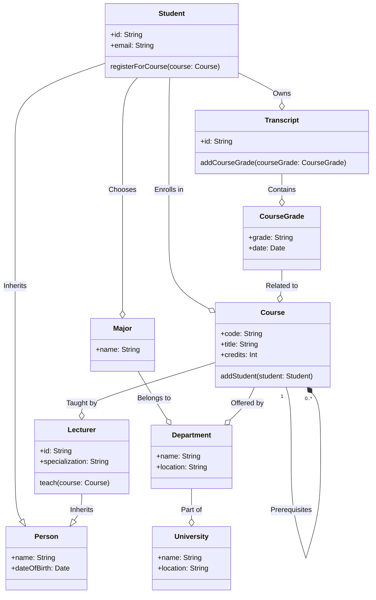
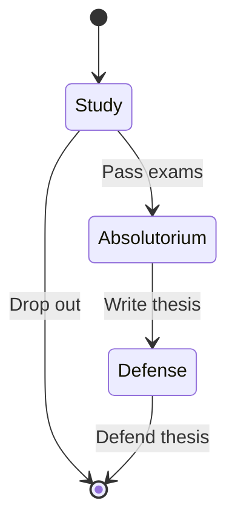
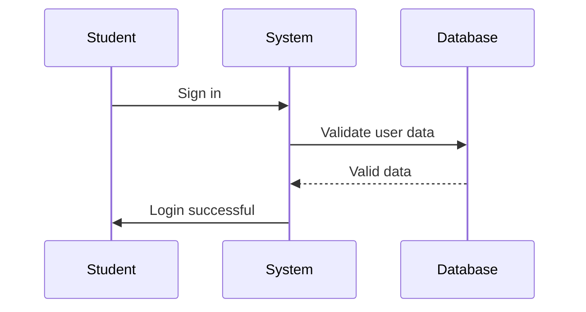

# INŻYNIERIA OPROGRAMOWANIA

## Zarządzanie projektem budowy oprogramowania: rodzaje działań, dobór metodyki oraz kontekst pozatechniczny

### Metodyka w zarządzaniu projektem

Zestaw pojęć, notacji, modeli i technik służących do analizy i projektowania systemu.

#### Rodzaje metodyk

-   **Ciężkie (formalne)**:

    -   **Przykłady**: Prince2, PMBoK/PMI
    -   **Charakterystyka**: Wysoka formalność, dużo dokumentów i zatwierdzeń.

-   **Lekkie (zwinne)**:
    -   **Przykłady**: SCRUM, XP, XPrince, Top10
    -   **Charakterystyka**: Mniej formalne, mniejszy nacisk na dokumentację.

#### Kategorie metodyk

-   **Zarządcze**: Skupiają się na organizacji pracy (Prince2, PMBoK, AgilePM).
-   **Wytwórcze**: Koncentrują się na procesie tworzenia oprogramowania (XP).
-   **Zarządczo-wytwórcze**: Łączą oba aspekty (SCRUM, RUP).

### Cykl życiowy oprogramowania

-   Faza strategiczna
    -   Określenie wymagań
    -   Analiza
    -   Projektowanie
    -   Implementacja, czyli rozwój, testowanie i tworzenie dokumentacji
    -   Instalacja
    -   Szkolenie i przygotowanie użytkowników
    -   Utrzymanie, konserwacja i pielęgnacja

#### Modele cyklu życiowego

#### Model kaskadowy

##### Zalety

-   **Planowalność**: Etapy są zdefiniowane i sekwencyjne, co ułatwia planowanie i monitorowanie projektu.
-   **Jasność i Prostota**: Każda faza ma konkretne wejście i wyjście.
-   **Zorientowanie na Dokumentację**: Generuje obszerną dokumentację na każdym etapie.

##### Wady

-   **Niewielka Elastyczność**: Trudno wprowadzić zmiany po zakończeniu etapów.
-   **Długi Czas Realizacji**: Projekt może być zakończony po długim czasie, co może być nieefektywne.
-   **Ryzyko Niepowodzenia**: Brak możliwości korekty błędów z wcześniejszych etapów.

#### Model spiralny i Realizacja Przyrostowa

##### Zalety

-   **Elastyczność**: Możliwość wprowadzenia zmian w każdej iteracji.
-   **Mniejsze Ryzyko**: Dzięki ciągłemu testowaniu i dostosowywaniu.
-   **Inkrementalny Rozwój**: Dostarczanie części funkcji systemu w każdym cyklu.

##### Wady

-   **Koszt**: Może być droższy przez dodatkowe testy i analizy ryzyka.
-   **Złożoność Zarządzania**: Wymaga starannego zarządzania i monitorowania.

#### Prototypowanie

##### Zalety

-   **Szybki Feedback od Klienta**: Umożliwia zrozumienie wymagań klienta przez praktyczne przedstawienie koncepcji.
-   **Eksploracja Techniczna**: Możliwość eksperymentowania z różnymi rozwiązaniami.

##### Wady

-   **Ryzyko Niewłaściwego Wdrożenia**: Prototyp może zostać błędnie traktowany jako gotowe rozwiązanie.
-   **Koszt Czasu i Zasobów**: Tworzenie prototypu to dodatkowy etap, który może być czasochłonny.

#### Montaż z gotowych komponentów

##### Zalety

-   **Szybkość Realizacji**: Skrócenie czasu realizacji przez użycie gotowych elementów.
-   **Niezawodność**: Gotowe komponenty są często dobrze przetestowane.

##### Wady

-   **Koszty Licencyjne**: Możliwe dodatkowe koszty związane z licencjami.
-   **Ryzyko Uzależnienia od Dostawcy**: Możliwość przerwania wsparcia dla używanych komponentów.

## Język UML – charakterystyka oraz sposób wsparcia różnorodnych modeli danych

### Charakterystyka UML

-   **Cel**: Służy do specyfikowania, konstruowania, wizualizowania i dokumentowania elementów systemu oprogramowania.
-   **Autorzy**: Stworzony przez Grady Boocha, Ivora Jacobsona i Jamesa Rumbaugha, każdy z nich autor innej metodyki.

### Metodyki wchodzące w skład UML

1. **OOAD**: Skupia się na projektowaniu i związkach ze środowiskiem implementacji. Nie wspiera analizy wymagań.
2. **OOSE**: Zajmuje się modelowaniem aspektu użytkowników i cyklu życiowego systemu, ale nie wspiera implementacji.
3. **OMT**: Służy do modelowania dziedziny przedmiotowej, ale nie wspiera modelowania użytkowników ani implementacji.

### Nowości w UML

-   **Prototypowanie**: Wprowadzenie konceptu prototypowania w UML.
-   **Komponenty**: Możliwość modelowania komponentów systemu.

### Mechanizmy rozszerzalności

1. **Prototypy `<<extend>>`, `<<include>>`**: Do meta-klasyfikacji elementów diagramu.
2. **Ograniczenia**: Warunki nałożone na element diagramu.
3. **Wartości etykietowane**: Oznaczenia stanu elementu, np. {nowe, rozpatrywane}.
4. **Komentarze**: Dodatkowe adnotacje niewprowadzające nowej informacji.

### Rodzaje diagramów

1. **Diagramy Statyczne**
    - Przypadków użycia
    - Klas

2. **Diagramy dynamiczne**
    - Aktywności
    - Stanów

3. **Diagramy interakcji**
    - Współpracy
    - Sekwencji

4. **Diagramy implementacyjne**
    - Komponentów
    - Wdrożeniowy

### Modele danych w UML

1. **Model obiektowy**: Reprezentowany przez diagram klas.
2. **Model przypadków użycia**: Reprezentowany przez diagram przypadków użycia.
3. **Model implementacji**: Zawiera diagramy komponentów i wdrożeniowe.
4. **Model dynamiczny**: Składa się z diagramów stanów, aktywności i interakcji.
5. **Model zarządzania**: Zawiera diagram pakietów.

## Wzorce projektowe oraz ramy programistyczne (frameworks) – charakterystyka, przykłady, zastosowania

### Wzorce projektowe

#### Wzorce kreacyjne

Wzorce kreacyjne skupiają się na mechanizmach tworzenia obiektów. Zamiast inicjalizować obiekt bezpośrednio, te wzorce korzystają z różnych technik, aby tworzenie obiektów było bardziej elastyczne, efektywne i niezależne. W efekcie, kody klientów są odseparowane od konkretnych klas obiektów, które są tworzone.

1.  Oddzielają logikę tworzenia obiektów od ich użycia.
2.  Ułatwiają zarządzanie zasobami i pamięcią.
3.  Zwiększają reużywalność i utrzymanie kodu.

-   **Factory**: Wzorzec Factory zapewnia mechanizm dla tworzenia rodzin powiązanych obiektów bez określania ich konkretnych klas. Celem jest separacja logiki tworzenia obiektów od ich używania, zwiększając w ten sposób elastyczność i czytelność kodu.

-   **Factory Method**: Jest to specjalizacja wzorca Factory, w której klasa bazowa definiuje interfejs do tworzenia obiektu, ale pozostawia implementację tego interfejsu dla klas pochodnych. Jest to bardzo użyteczne w scenariuszach, gdzie klasa nie może przewidzieć klasy obiektów, które ma tworzyć.

-   **Abstract Factory**: Jest to rozwinięcie wzorca Factory, które dostarcza interfejs dla tworzenia rodzin obiektów zależnych lub powiązanych, ale bez określenia ich konkretnych klas. Pozwala to na więcej niż jedną implementację zestawu powiązanych produktów.

-   **Singleton**: Ten wzorzec ma na celu zapewnienie, że klasa ma tylko jedną instancję i dostarcza globalny punkt dostępu do tej instancji. Jest to kluczowe, gdy jeden obiekt kontroluje dostęp do zasobu, na przykład do bazy danych.

-   **Builder**: Wzorzec Builder służy do konstrukcji złożonego obiektu krok po kroku. Jest to przydatne, gdy obiekt musi być skonstruowany z wielu możliwych konfiguracji.

-   **Prototype**: Jest to wzorzec, który tworzy nowe obiekty przez kopiowanie istniejących obiektów, znanych jako "prototypy". Jest to użyteczne, gdy koszt inicjalizacji obiektu od zera jest większy niż koszt jego sklonowania.

#### Wzorce strukturalne

Wzorce strukturalne dotyczą kompozycji obiektów i klas. Celem jest uproszczenie struktury lub dostarczenie nowych funkcji. Osiąga się to przez definiowanie relacji i interakcji między obiektami. Wzorce te pozwalają na tworzenie większych systemów z mniejszych, prostszych komponentów.

1.  Ułatwiają integrację różnych interfejsów.
2.  Promują kompozycję zamiast dziedziczenia.
3.  Zwiększają elastyczność i efektywność kodu.

-   **Adapter**: Wzorzec Adapter jest używany, gdy wymaganiem jest, aby dwie różne klasy pracowały razem, pomimo że mają niekompatybilne interfejsy. Adapter osiąga to przez umożliwienie jednemu obiektowi interakcji z drugim obiektem poprzez interfejs, który jest mu znany.

-   **Bridge**: Jest to wzorzec projektowy, który odseparowuje abstrakcję od jej implementacji, umożliwiając obu stronom na niezależną modyfikację. Jest to przydatne do oddzielenia interfejsu użytkownika od logiki biznesowej.

-   **Composite**: Ten wzorzec jest używany do traktowania zarówno pojedynczych obiektów, jak i ich kompozycji w jednolity sposób. Jest to szczególnie użyteczne w hierarchii obiektów, które reprezentują elementy część-całość.

-   **Decorator**: Jest to strukturalny wzorzec projektowy, który pozwala na dodanie nowych funkcji do obiektów poprzez umieszczenie tych obiektów w specjalnych klasach opakowujących.

-   **Facade**: Ten wzorzec dostarcza zcentralizowany interfejs dla zestawu interfejsów w subsystemie, upraszczając w ten sposób interfejs użytkownika i czyniąc podsystem łatwiejszym w obszarze.

-   **Flyweight**: Jest to wzorzec używany w celu zmniejszenia liczby obiektów utworzonych przez aplikację, co pozwala na oszczędność zasobów, takich jak pamięć.

-   **Proxy**: Ten wzorzec dostarcza obiekt zastępczy dla innego obiektu, aby kontrolować dostęp do niego. Jest to przydatne w przypadkach, takich jak opóźnione ładowanie, kontrola dostępu, czy logowanie.

Przepraszam za pominięcie wzorców behawioralnych. Oto ich rozbudowane definicje:

#### Wzorce behawioralne

Wzorce behawioralne koncentrują się na algorytmach, komunikacji między obiektami i odpowiedzialnościach. Umożliwiają one lepszą organizację i podział kodu, co prowadzi do systemów, które są łatwiejsze do zrozumienia, utrzymania i rozbudowy.

1.  Poprawiają komunikację i interakcje między obiektami.
2.  Ułatwiają rozszerzenie i modyfikację funkcjonalności.
3.  Oddzielają obowiązki i rolę różnych komponentów.

-   **Chain of Responsibility**: Jest to wzorzec, który przekazuje żądanie wzdłuż łańcucha obiektów obsługujących. Każdy z tych obiektów decyduje, czy przetworzyć żądanie, czy przekazać je dalej w łańcuchu. Pozwala to na odseparowanie kodu wysyłającego żądania od kodu je obsługującego.

-   **Command**: Ten wzorzec enkapsuluje żądanie jako obiekt, co umożliwia parametryzację klientów z różnymi żądaniami, kolejkowanie żądań oraz zapisywanie ich historii. Jest to użyteczne w scenariuszach, które wymagają odwoływania operacji, implementacji logiki redo-undo czy też delegowania działań.

-   **Interpreter**: Jest to wzorzec używany do definiowania gramatyki dla prostych języków i interpretowania jej wyrażeń. Umożliwia to reprezentowanie reguł języka jako obiektów i ich interpretację.

-   **Iterator**: Wzorzec Iterator dostarcza spójny interfejs do przeglądania kolekcji obiektów. Pozwala to na iterowanie przez kolekcję bez ujawniania jej wewnętrznej struktury.

-   **Mediator**: Jest to wzorzec, który zmniejsza sprzężenie między klasami, centralizując zewnętrzne komunikacje. Dzięki temu można łatwiej zmieniać i rozwijać system, ponieważ komponenty są mniej zależne od siebie.

-   **Memento**: Ten wzorzec umożliwia zapisywanie i przywracanie stanu obiektu bez naruszania jego enkapsulacji. Jest to użyteczne w operacjach, które wymagają możliwości cofania.

-   **Observer**: Jest to wzorzec, w którym obiekt (nazywany tematem) utrzymuje listę obiektów (obserwatorów), które są powiadamiane o zmianach stanu tematu. Jest to podstawa dla wielu mechanizmów komunikacji w programowaniu zdarzeniowym.

-   **State**: Wzorzec State pozwala obiektowi zmieniać swoje zachowanie w zależności od wewnętrznego stanu. Jest to jako alternatywa do umieszczania dużej liczby instrukcji warunkowych w kodzie obiektu.

-   **Strategy**: Jest to wzorzec, który definiuje rodzinę algorytmów i enkapsuluje każdy z nich jako osobny obiekt. Pozwala to na ich zamienne używanie i łatwe dodawanie nowych algorytmów.

-   **Template Method**: Ten wzorzec definiuje szkielet algorytmu w metodzie, ale opóźnia niektóre kroki do klas pochodnych. Pozwala to na reużywanie kodu i unikanie duplikacji.

-   **Visitor**: Jest to wzorzec, który dodaje nową operację do klas obiektów bez modyfikacji tych klas. Jest to użyteczne, gdy różne operacje są potrzebne dla różnych typów obiektów bez ich modyfikacji.

### Framework

Framework to zbiór narzędzi, bibliotek i najlepszych praktyk, które ułatwiają rozwijanie oprogramowania. Ustala pewne reguły i struktury, zapewniając jednocześnie dużą elastyczność w modyfikacji i dodawaniu nowych funkcji. Framework często zawiera gotowe komponenty do wykonania określonych zadań, jak np. autoryzacja użytkownika, routing czy dostęp do bazy danych.

#### Zalety

-   Szybkość rozwoju
-   Wzorce projektowe
-   Ponowne użycie kodu
-   Wsparcie społeczności

#### Wady

-   Ograniczenia w kontroli nad aplikacją
-   Początkowa krzywa nauki
-   Możliwość "nadmiaru" funkcji, które nie są używane w projekcie

#### Zastosowania

##### Aplikacje webowe

Dzięki frameworkom front-endowym i back-endowym można szybko i efektywnie budować różnego rodzaju strony i aplikacje internetowe.

##### Machine learning

Frameworki jak TensorFlow czy PyTorch umożliwiają tworzenie skomplikowanych modeli uczenia maszynowego.

##### Game Development

Frameworki takie jak Unity czy Unreal Engine oferują zestaw narzędzi do tworzenia gier na różne platformy.

##### Automatyzacja i testowanie

Frameworki do automatyzacji jak Selenium czy JUnit, ułatwiają testowanie aplikacji.

##### Mikroserwisy i cloud

Frameworki takie jak Spring Boot czy .NET Core są często używane w architekturach mikroserwisów i rozwiązaniach chmurowych.

## Zapewnienie jakości oraz testowanie oprogramowania, normy, metody i kryteria

Zapewnienie jakości (Quality Assurance) i testowanie oprogramowania to kluczowe elementy w procesie wytwarzania oprogramowania, mające na celu zapewnienie, że finalny produkt spełni określone standardy i wymagania.

### Normy

-   **ISO/IEC 25010**: Jest to międzynarodowy standard, który definiuje jakość oprogramowania na różnych poziomach, od użyteczności po wydajność.
-   **IEEE 829**: Jest to standard dotyczący dokumentacji testów oprogramowania.
-   **ISTQB**: Jest to zestaw wytycznych i terminologii dla testerów oprogramowania.

### Metody

-   **Testy Jednostkowe**: Sprawdzają funkcje pojedynczych komponentów, często z użyciem ramówek takich jak JUnit.
-   **Testy Integracyjne**: Koncentrują się na interakcjach między różnymi komponentami oprogramowania.
-   **Testy Systemowe**: Oceniają zachowanie całego systemu w warunkach jak najbardziej zbliżonych do rzeczywistości.
-   **Testy Akceptacyjne**: Sprawdzają, czy oprogramowanie spełnia wymagania klienta.

### Kryteria

-   **Pokrycie Kodu**: Miara ta pokazuje, jak dużą część kodu źródłowego przetestowano.
-   **Defekty na Liczbę Linii Kodu (D/LLOC)**: To kryterium mierzy liczbę znalezionych błędów na jednostkę linii kodu.
-   **Odporność na Awarię**: Mierzy zdolność systemu do kontynuowania działania w przypadku wystąpienia błędów.
-   **Czas Odpowiedzi**: Określa, jak szybko system odpowiada na różne rodzaje zapytań.

Oczywiście, postaram się połączyć obydwa teksty w jeden spójny i zorganizowany dokument. Biorąc pod uwagę, że jesteś inżynierem front-endu, pewnie zależy Ci na przejrzystości i czytelności, także zastosuję te zasady przy redagowaniu.

### Ogólne kryteria jakości

-   **Wydajność systemu**: Określa, jak szybko system realizuje zadania.
-   **Interfejsy systemu**: Sprawdzenie integracji między różnymi komponentami.
-   **Zużycie zasobów**: Ilość używanej pamięci i zasobów obliczeniowych.
-   **Bezpieczeństwo i Zabezpieczenia**: Ochrona przed nieautoryzowanym dostępem.
-   **Przenośność**: Zdolność do działania na różnych systemach operacyjnych.
-   **Niezawodność**: Częstotliwość i skutki awarii.
-   **Odtwarzalność**: Czas potrzebny do przywrócenia funkcji po awarii.
-   **Kompletność i jakość funkcji**: Zakres i głębokość funkcji oferowanych przez system.
-   **Modyfikowalność**: Łatwość wprowadzania zmian.
-   **Obciążalność**: Maksymalna liczba użytkowników korzystających z systemu jednocześnie.
-   **Skalowalność**: Zdolność systemu do rosnącej liczby użytkowników i danych.
-   **Akceptowalność**: Poziom satysfakcji użytkowników.
-   **Jakość dokumentacji**: Czytelność i użyteczność dokumentacji.

### Miary niezawodności

-   Prawdopodobieństwo błędnego wykonania
-   Częstotliwość występowania błędnych wykonań
-   Średni czas między błędnymi wykonaniami
-   Dostępność systemu

### Techniki Testowania

#### Testy na zasadzie białej skrzynki (testy strukturalne)

Te testy skupiają się na logice wewnętrznej programu. Stosuje się do tego kody diagnostyczne i debuggery, które pozwalają śledzić np. zawartość zmiennych. Wymagają przygotowania danych testowych, aby przetestować każdą możliwą ścieżkę w programie.

#### Testy na zasadzie czarnej skrzynki (testy funkcjonalne)

Te testy nie zajmują się logiką wewnętrzną programu, lecz skupiają się na danych wejściowych i wynikach. Dzięki tablicom decyzyjnym i grafom przyczyna-skutek można testować kombinacje różnych typów danych.

### Narzędzia testowania

-   **Debuggery**: Pozwalają na krokowe wykonywanie programu i kontrolę zmiennych.
-   **Analizatory przykrycia kodu**: Pokazują, które fragmenty kodu zostały wykonane podczas testów.
-   **Programy porównujące**: Używane do porównania wyników testów z wynikami oczekiwanymi.
-   **Technika "posiewania błędów"**: Testowanie metod testowania poprzez celowe wprowadzanie błędów.

### Zapewnienie jakości oprogramowania

Planowany i systematyczny wzorzec działań potrzebnych do dostarczenia adekwatnego potwierdzenia, że element lub produkt jest zgodny z ustanowionymi wymaganiami technicznymi i funkcjonalnymi. Plan zapewnienia jakości oprogramowania to dokument kierujący wszystkimi działaniami związanymi z jakością w projekcie.

## Rodzaje, metody specyfikowania oraz rola wymagań w procesie wytwarzania oprogramowania

### Faza określenia wymagań

W tej fazie klient współpracuje z deweloperami, aby zdefiniować, co projekt ma osiągnąć. To etap, który wymaga intensywnej współpracy i komunikacji między klientem, przyszłymi użytkownikami i specjalistami w dziedzinie.

### Poziomy ogólności opisu wymagań

-   **Definicja wymagań**: To wstępna rozmowa z klientem, gdzie używa się języka naturalnego do ogólnego opisu projektu.
-   **Specyfikacja wymagań**: Tu używa się ustrukturalizowanego języka i częściowo sformalizowanych notacji.
-   **Specyfikacja oprogramowania**: To już formalny dokument, który dzieli wymagania na zwięzłe punkty i jest podstawą dla testowania.

### Cechy dobrego opisu wymagań

-   Kompletny i spójny
-   Zorientowany na zachowanie systemu, a nie na jego implementację
-   Elastyczny i otwarty na zmiany
-   Precyzyjny w opisie skrajnych i wyjątkowych sytuacji

### Metody rozpoznania wymagań

-   **Wywiady i przeglądy**: Lista pytań dotyczących różnych aspektów projektu.
-   **Studium nad istniejącym oprogramowaniem**: Analiza zalet i wad istniejącego oprogramowania.
-   **Studium wymagań systemowych i osiągalności**: Oceniają, jak nowy system wpasuje się w istniejącą infrastrukturę.
-   **Prototypowanie**: Tworzenie uproszczonej wersji produktu.

### Rodzaje wymagań

1. **Funkcjonalne**: Opisują, co system ma robić.
    - Kto będzie użytkownikiem
    - Jakie funkcje są potrzebne dla różnych użytkowników
    - Jakie są zewnętrzne systemy i ograniczenia
2. **Niefunkcjonalne**: Opisują, jak dobrze system ma coś robić.
    - Ograniczenia produktu, procesu i zewnętrzne
    - Wymagania dotyczące wydajności, bezpieczeństwa itd.

### Czynniki w konstruowaniu wymagań niefunkcjonalnych

-   Możliwości systemu
-   Objętość, szybkość i dokładność
-   Ograniczenia różnego typu
-   Interfejsy (komunikacyjne, sprzętowe, oprogramowania)
-   Adaptowalność i bezpieczeństwo
-   Zasoby i skala czasowa

### Metody specyfikacji wymagań

-   **Język naturalny**: Prosty ale nieprecyzyjny
-   **Formalizm matematyczny**: Używany w specjalnych przypadkach
-   **Język naturalny strukturalny**: Ułatwia komunikację, ograniczając język i format.
-   **Tablice i formularze**: Do prezentacji danych w sposób uporządkowany
-   **Diagramy**: Używane do graficznej prezentacji wymagań (np. diagramy przypadków użycia)
