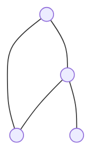
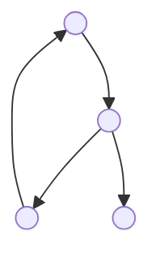
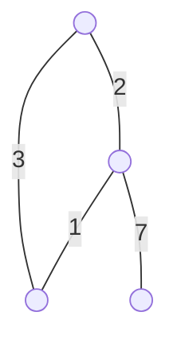
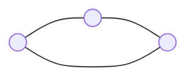
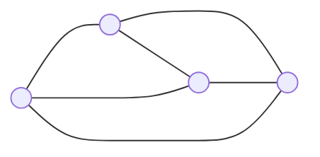
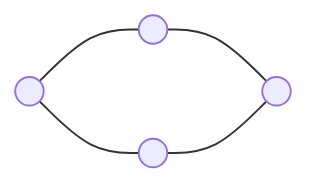
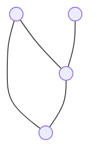
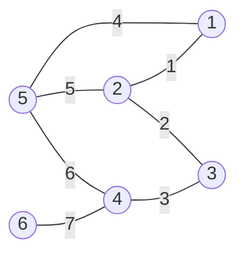
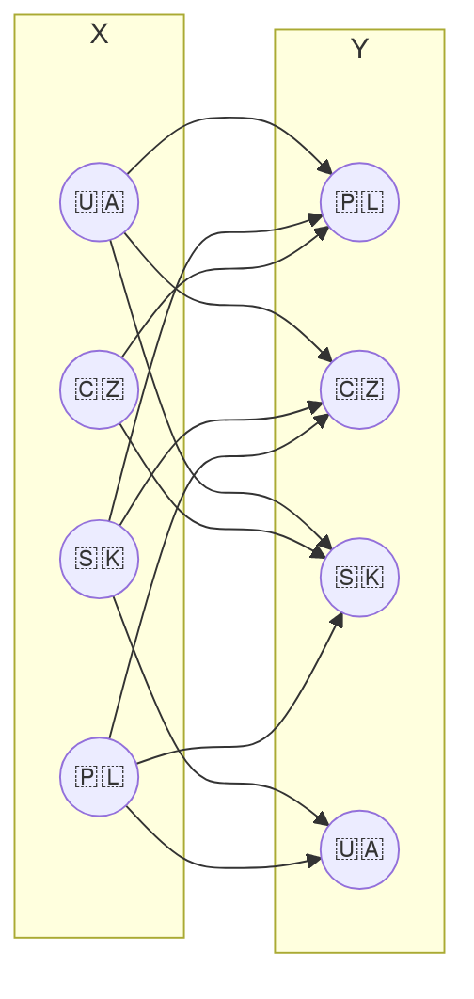

# MATEMATYKA

## Całka nieoznaczona, oznaczona, zastosowanie i techniki obliczania

Całka jest podstawowym pojęciem w matematyce, które jest związane z obliczaniem obszarów pod krzywymi oraz odwrotnym procesem różniczkowania.

### Całka nieoznaczona

To odwrócona operacja kalkulacji pochodnej. Kiedy oblicza się pochodną, znajduje się tempo zmiany funkcji. Całka nieoznaczona jest odwrotnością tego procesu. Oznacza to, że dla danej funkcji $f$ istnieje $F$, której pochodna $F'$ jest równa $f$, zatem $F'(x) = f(x)$.

Funkcję $F(x)$ spełniającą powyższy warunek nazywa się funkcją pierwotną.

> **Wzór całki nieoznaczonej**
>
> $\begin{aligned}\int f(x) \, dx = F(x) + C\end{aligned}$
>
> Obecność stałej całkowania $C$ wynika z faktu, że pochodna stałej jest zawsze równa zeru.

### Całka oznaczona

Całka oznaczona jest równa polu powierzchni pod krzywą funkcji $f(x)$ w określonym przedziale. Jeżeli $F(x)$ jest funkcją pierwotną funkcji $f(x)$ ciągłej w danym przedziale $\left\langle{x_1};{x_2}\right\rangle$, to różnicę funkcji pierwotnych $F(x_1)$ oraz $F(x_2)$ nazywamy całką oznaczoną dla funkcji $f$ od $x_1$ do $x_2$.

> **Wzór całki nieoznaczonej**
>
> $\begin{aligned}\int_{x_1}^{x_2}{f(x) \, dx} = \left[F(x)\right]_{x_1}^{x_2} = {F(x_2) - F(x_1)}\end{aligned}$

### Techniki obliczania całek

-   **Całkowanie funkcji elementarnych**

    Obliczanie całek funkcji podstawowych na podstawie reguł różniczkowania i wiedzy o pochodnych. To po prostu znalezienie funkcji, której pochodna jest zadaną funkcją. Na przykład, jeśli pochodna funkcji to $2x$, to całka nieoznaczona tej funkcji to $x^2$.

-   **Całkowanie metodą podstawienia**

    Całkowanie przez podstawienie stosujemy, gdy wśród funkcji podcałkowej potrafimy wyodrębnić pewną funkcję i jej pochodną. Polega na zamianie zmiennych w celu uproszczenia całki.

> **Przykładowe obliczenie całki $\int{8\cos{4x} \, dx}$**
>
> 1.  Podstawienie $4x$ jako nowej zmiennej $t$ i obliczenie pochodnej $t$ względem $x$
>
>     $
>     \begin{aligned}
>         t & = 4x & dt & = 4 \, dx \\
>         \frac{dt}{dx} & = 4 & dx & = \frac{dt}{4}
>     \end{aligned}
>     $
>
> 2.  Podstawienie zmiennych do wyrażenia
>
>     $\begin{aligned}\int{8\cos{t} \, \frac{dt}{4}} = \int{\cancel{8}\cos{t} \, \frac{dt}{\cancel{4}}} = \int{2\cos{t} \, dt}\end{aligned}$
>
> 3.  Uproszczenie wyrażenia wzorem $\int{\cos{x} \, dx} = \sin{x} + C$
>
>     $\begin{aligned}\int{2\cos{t} \, dt} = 2\sin{t} + C\end{aligned}$
>
> 4.  Podstawienie pierwotnej wartości do zmiennej $t$
>
>     $\begin{aligned}\int{8\cos{4x} \, dx} = 2\sin{t} + C = 2\sin{4x} + C\end{aligned}$

-   **Całkowanie przez części**

    Wykorzystuje się do rozkładania całki dwóch funkcji, korzystając z reguły pochodzenia iloczynu dwóch funkcji. Całkowanie przez części jest dozwolone wtedy i tylko wtedy, gdy pochodne obu funkcji są funkcjami ciągłymi.

    Jeżeli $f$ i $g$ mają ciągłe pochodne, to $\int{f(x) \cdot g'(x) \, dx} = f(x) \cdot g(x) − \int{f'(x) \cdot g(x) \, dx}$.

> **Przykładowe obliczenie całki $\int{x \sin{x} \, dx}$**
>
> 1.  Obliczenie pochodnych funkcji $f$ i $g$
>
>     $
>     \begin{aligned}
>         f(x) & = x & g'(x) & = \sin{x} \\
>         f'(x) & = 1 & g(x) & = \cos{x}
>     \end{aligned}
>     $
>
> 2.  Podstawienie do wzoru
>
>     $\begin{aligned}\int{x\sin{x} \, dx} = x\cos{x} - \int{1 \cdot \cos{x} \, dx}\end{aligned}$
>
> 3.  Uproszczenie wyrażenia
>
>     $\begin{aligned}x\cos{x} - \int{\cos{x} \, dx} = x\cos{x} - \sin{x} + C\end{aligned}$

-   **Obliczanie pola pod krzywą dla przedziału**

> **Przykładowe obliczenie pola pod funkcją $3x^2 + 5$ w przedziale $\left\langle3;5\right\rangle$**
>
> 1.  Obliczenie całki $\int{3x^2 + 5 \, dx}$
>
>     $\begin{aligned}\int{3x^2 + 5 \, dx} = x^3 + 5x\end{aligned}$
>
> 2.  Podstawienie do wzoru
>
>     $
>     \begin{aligned}
>         \int_{3}^{5}{3x^2 + 5 \, dx} & = \left[x^3 + 5x\right]_3^5 \\
>         \int_{3}^{5}{3x^2 + 5 \, dx} & = (5^3 + 5 \cdot 5) - (3^3 + 5 \cdot 3) = (125 + 25) - (27 + 15) \\
>         \int_{3}^{5}{3x^2 + 5 \, dx} & = 150 - 42 = 108
>     \end{aligned}
>     $

## Wielomian i szereg Taylora funkcji rzeczywistej

Jeżeli funkcja $f$ ma w przedziale $\left\langle x_0; x \right\rangle$ pochodną rzędu $n - 1$ oraz pochodną rzędu $n$ w przedziale $(x_0; x)$, wówczas istnieje takie $c$, że $c \in (x_0; x)$.

> **Wzór wielomianu Taylora**
>
> $\begin{aligned}f(x) = f(x_0) + \frac{f^{(1)}(x_0)}{1!} \cdot (x - x_0) + \ldots + \frac{f^{(n-1)}(x_0)}{(n-1)!} \cdot (x - x_0)^{n - 1} + \frac{f^{(n)}(c)}{n!} \cdot (x - x_0)^n\end{aligned}$
>
> **Wielomian Taylora**
>
> $\begin{aligned}f(x_0) + \frac{f^{(1)}(x_0)}{1!} \cdot (x - x_0) + \ldots + \frac{f^{(n-1)}(x_0)}{(n-1)!} \cdot (x - x_0)^{n - 1}\end{aligned}$
>
> **n-ta reszta Lagrange'a rozwinięcia Taylora**
>
> $\begin{aligned}R_n = \frac{f^{(n)}(c)}{n!} \cdot (x - x_0)^n\end{aligned}$

### Szereg Taylora

Jest to matematyczny sposób przybliżania funkcji różniczkowalnej za pomocą nieskończonego szeregu wielomianowego. Dla funkcji nieskończenie wiele razy różniczkowalnych uzasadnione jest rozważanie nieskończonych wielomianów Taylora.

> **Wzór szeregu Taylora**
>
> $\begin{aligned}\sum_{n = 0}^{\infty}{\frac{f^{(n)}(x_0)}{n!} \cdot (x - x_0)^n}\end{aligned}$

Szeregiem Maclaurina nazywamy szereg Taylora, dla którego $x_0 = 0$.

> **Wzór szeregu Maclaurina**
>
> $\begin{aligned}\sum_{n = 0}^{\infty}{\frac{f^{(n)}(0)}{n!} \cdot x^n}\end{aligned}$

## Układy równań liniowych, różne metody rozwiazywania, liczba rozwiązań

Układem $m$ równań liniowych z $n$ niewiadomymi $x_1$, $x_2$, ..., $x_n$, gdzie $m$, $n \in \N$ nazywamy układ równań, gdzie $a_{ij} \in \R$, $b_i \in \R$ dla $1 \leq i \leq m$ oraz $1 \leq n \leq n$.

Rozwiązaniem układu równań liniowych nazywamy ciąg ($x_1$, $x_2$, $\ldots$, $x_n$) liczb rzeczywistych spełniających ten układ. Układ równań, który nie ma rozwiązania, nazywamy układem sprzecznym.

> **Postać układu równań**
>
> $
> \begin{aligned}
>     \begin{cases}
>         a_{11} x_1 & + & a_{12} x_2 & + & \ldots & + & a_{1n} x_n & = b_1 \\
>         a_{21} x_1 & + & a_{22} x_2 & + & \ldots & + & a_{2n} x_n & = b_2 \\
>         \vdots & & \vdots & & \ddots & & \vdots & \vdots \\
>         a_{m1} x_1 & + & a_{m2} x_2 & + & \ldots & + & a_{mn} x_n & = b_m
>     \end{cases}
> \end{aligned}
> $
>
> $
> \begin{aligned}
>     \begin{bmatrix}
>         a_{11} x_1 & + & a_{12} x_2 & + & \ldots & + & a_{1n} x_n \\
>         a_{21} x_1 & + & a_{22} x_2 & + & \ldots & + & a_{2n} x_n \\
>         \vdots & & \vdots & & \ddots & & \vdots \\
>         a_{m1} x_1 & + & a_{m2} x_2 & + & \ldots & + & a_{mn} x_n
>     \end{bmatrix}
>     =
>     \begin{bmatrix}
>         b_1 \\
>         b_2 \\
>         \vdots \\
>         b_m
>     \end{bmatrix}
>     \begin{bmatrix}
>         a_{11} & a_{12} & \ldots & a_{1n} \\
>         a_{21} & a_{22} & \ldots & a_{2n} \\
>         \vdots & \vdots & \ddots & \vdots \\
>         a_{m1} & a_{m2} & \ldots & a_{mn}
>     \end{bmatrix}
>     \begin{bmatrix}
>         x_1 \\
>         x_2 \\
>         \vdots \\
>         x_n
>     \end{bmatrix}
>     =
>     \begin{bmatrix}
>         b_1 \\
>         b_2 \\
>         \vdots \\
>         b_m
>     \end{bmatrix}
> \end{aligned}
> $

### Metody rozwiązywania

#### Metoda substytucji

Ta metoda jest najprostsza i często stosowana do układów równań liniowych. Polega na rozwiązaniu jednego równania względem jednej zmiennej i podstawieniu tego wyniku do pozostałych równań. Następnie powtarza się ten proces dla pozostałych zmiennych, aż do uzyskania rozwiązania.

#### Metoda eliminacji Gaussa

Jest to bardziej ogólna metoda rozwiązywania układów równań liniowych. Polega na przekształcaniu układu równań tak, aby stopniowo eliminować zmienne i uzyskać wyniki. Obliczając rząd macierzy metodą Gaussa, należy za pomocą operacji elementarnych na wierszach sprowadzić macierz do macierzy schodkowej. Wtedy wszystkie niezerowe wiersze są liniowo niezależne i można łatwo odczytać rząd macierzy.

> **Przykładowe rozwiązanie metodą Gaussa**
>
> $
> A \mid B =
> \begin{cases}
>     x_1 & - & 3x_2 & + & 2x_3 & = & 3 \\
>     x_1 & + & x_2 & - & 2x_3 & = & 1 \\
>     -2x_1 & - & x_2 & + & x_3 & = & -1
> \end{cases}
> $
>
> $
> A \mid B =
> \left[
>     \begin{matrix}
>         1 & -3 & 2 \\
>         1 & 1 & -2 \\
>         2 & -1 & 1
>     \end{matrix}
>     \, \left |\,
>     \begin{matrix}
>         3 \\
>         1 \\
>         -1
>     \end{matrix}
>     \right.
> \right]
> $
>
> 1. Odejmowanie wiersza pierwszego od wiersza drugiego i dwukrotnie od wiersza trzeciego
>
>     $
>     A \mid B \sim
>     \left[
>         \begin{matrix}
>             1 & -3 & 2 \\
>             0 & 4 & -4 \\
>             0 & 5 & -3
>         \end{matrix}
>         \, \left |\,
>         \begin{matrix}
>             3 \\
>             -2 \\
>             -7
>         \end{matrix}
>         \right.
>     \right]
>     $
>
> 2. Dzielenie drugiego wiersza przez 4
>
>     $
>     A \mid B \sim
>     \left[
>         \begin{matrix}
>             1 & -3 & 2 \\
>             0 & 1 & -1 \\
>             0 & 5 & -3
>         \end{matrix}
>         \, \left |\,
>         \begin{matrix}
>             3 \\
>             -0.5 \\
>             -7
>         \end{matrix}
>         \right.
>     \right]
>     $
>
> 3. Odejmowanie pięciokrotnie wiersza drugiego od wiersza trzeciego
>
>     $
>     A \mid B \sim
>     \left[
>         \begin{matrix}
>             1 & -3 & 2 \\
>             0 & 1 & -1 \\
>             0 & 0 & 2
>         \end{matrix}
>         \, \left |\,
>         \begin{matrix}
>             3 \\
>             -0.5 \\
>             -4.5
>         \end{matrix}
>         \right.
>     \right]
>     $
>
> 4. Dzielenie trzeciego wiersza przez 2 i doprowadzenie do macierzy schodkowej
>
>     $
>     A \mid B \sim
>     \left[
>         \begin{matrix}
>             1 & -3 & 2 \\
>             0 & 1 & -1 \\
>             0 & 0 & 1
>         \end{matrix}
>         \, \left |\,
>         \begin{matrix}
>             3 \\
>             -0.5 \\
>             -2.25
>         \end{matrix}
>         \right.
>     \right]
>     $
>
>     $
>     A \mid B \sim
>     \begin{cases}
>         x_1 & - & 3x_2 & + & 2x_3 & = & 3 \\
>         & & x_2 & - &  x_3 & = & -0.5 \\
>         & & & & x_3 & = & -2.25
>     \end{cases}
>     $
>
> 5. Obliczenie niewiadomych
>
>     $
>     x_3 = -2.25
>     $
>
>     $
>     \begin{aligned}
>         x_2 & - x_3 = -0.5  \\
>         x_2 & = -0.5 + x_3  \\
>         x_2 & = -0.5 - 2.25 \\
>         x_2 & = -2.75 \\
>     \end{aligned}
>     $
>
>     $
>     \begin{aligned}
>         x_1 & - 3x_2 + 2x_3 = 3 \\
>         x_1 & = 3 + 3x_2 - 2x_3 \\
>         x_1 & = 3 + 3 \cdot (-2.75) - 2 \cdot (-2.25) \\
>         x_1 & = 3 - 8.25 + 4.5 \\
>         x_1 & = -0.75
>     \end{aligned}
>     $

#### Metoda Cramera

Układem Cramera jest jest układ oznaczony (ma dokładnie jedno rozwiązanie) wtedy i tylko wtedy, gdy ma on niezerowy wyznacznik. Liczba równań układu Cramera musi być równa liczbie jego nie wiadomych.

Niech dany będzie układ równań liniowych $x_1 \cdot a_1 + \ldots + x_n \cdot a_n = b$, gdzie $x = (x_1, \ldots, x_n)$ oraz $b = (b_1, \ldots, b_n)$.

1. $\det(a_1, \ldots, a_n) \ne 0$

-   **układ oznaczony** (ma jedno i tylko jedno rozwiązanie)

> **Wzory oznaczonego układu Cramera**
>
> $
> \begin{aligned}
>     x_1 & = \frac{\det(b, a_2, \ldots, a_n)}{\det(a_1, a_2, \ldots, a_n)} \\
>     & \vdots \\
>     x_n & = \frac{\det(a_1, \ldots, a_{n-1}, b)}{\det(a_1, \ldots, a_{n-1}, a_n)}
> \end{aligned}
> $

2. $\det( a_1, \ldots, a_n) = 0$

-   **układ sprzeczny** (nie ma rozwiązań), gdy choć jeden wyznacznik we wzorach Cramera zawierający $b$ jest różny od zera

-   **układ nieoznaczony** (ma więcej niż jedno rozwiązanie) lub sprzeczny, gdy wszystkie wyznaczniki we wzorach Cramera zawierające $b$ są równe zeru.

> **Wzór Cramera dla macierzy kwadratowej drugiego stopnia**
>
> $
> \begin{aligned}
>     A \mid B = \begin{cases}
>         ax + by = e \\
>         cx + dy = f
>     \end{cases}
> \end{aligned}
> $
>
> $
> \begin{aligned}
>     \begin{bmatrix}a & b \\ c & d\end{bmatrix}\begin{bmatrix}x \\ y\end{bmatrix} = \begin{bmatrix}e \\ f\end{bmatrix}
> \end{aligned}
> $
>
> $
> \begin{aligned}
>     x = \frac{\begin{vmatrix}e & b \\ f & d\end{vmatrix}}{\begin{vmatrix}a & b \\ c & d\end{vmatrix}} = \frac{e \cdot d - b \cdot f}{a \cdot d - b \cdot c}
> \end{aligned}
> $
>
> $
> \begin{aligned}
>     y = \frac{\begin{vmatrix}a & e \\ c & f\end{vmatrix}}{\begin{vmatrix}a & b \\ c & d\end{vmatrix}} = \frac{a \cdot f - e \cdot c}{a \cdot d - b \cdot c}
> \end{aligned}
> $
>
> **Przykładowe rozwiązanie metodą Cramera**
>
> $
> \begin{aligned}
>     A \mid B = \begin{cases}
>         2x + 5y + 3z = 5 \\
>         4x + 2y + 5z = 4 \\
>         3x + 8y + 4z = 9
>     \end{cases}
> \end{aligned}
> $
>
> $
> \begin{aligned}
>     \det{A} & = \begin{vmatrix}2 & 5 & 3 \\ 4 & 2 & 5 \\ 3 & 8 & 4\end{vmatrix} = 16 + 96 + 75 - 18 - 80 - 80 = 9 \\
>     \\
>     \det{A_x} & = \begin{vmatrix}5 & 5 & 3 \\ 4 & 2 & 5 \\ 9 & 8 & 4\end{vmatrix} = 40 + 96 + 225 - 54 - 200 - 80 = 27 \\
>     \det{A_y} & = \begin{vmatrix}2 & 5 & 3 \\ 4 & 4 & 5 \\ 3 & 9 & 4\end{vmatrix} = 32 + 108 + 75 - 36 - 90 - 80 = 9 \\
>     \det{A_z} & = \begin{vmatrix}2 & 5 & 5 \\ 4 & 2 & 4 \\ 3 & 8 & 9\end{vmatrix} = 36 + 160 + 60 - 30 - 64 - 180 = -18
> \end{aligned}
> $
>
> $
> \begin{aligned}
>     x & = \frac{\det{A_x}}{\det{A}} & y & = \frac{\det{A_y}}{\det{A}} & z & = \frac{\det{A_z}}{\det{A}} \\
>     \\
>     x & = \frac{27}{9} & y & = \frac{9}{9} & z & = \frac{-18}{9} \\
>     x & = 3 & y & = 1 & z & = -2
> \end{aligned}
> $

##### Reguła Sarrusa

Jest to praktyczny sposób obliczania wyznacznika trzeciego stopnia, gdzie skorzystanie z rozwinięcia Laplace'a może być niewygodne.

> **Wzór wyznacznika Sarrusa**
>
> $
> \begin{aligned}
>     A = \begin{bmatrix}
>         a_{11} & a_{12} & a_{13} \\
>         a_{21} & a_{22} & a_{23} \\
>         a_{31} & a_{32} & a_{33}
>     \end{bmatrix}
> \end{aligned}
> $
>
> $
> \begin{aligned}
>     \det{A} = \begin{vmatrix}
>         a_{11} & a_{12} & a_{13} \\
>         a_{21} & a_{22} & a_{23} \\
>         a_{31} & a_{32} & a_{33}
>     \end{vmatrix} = a_{11}a_{22}a_{33}+a_{21}a_{32}a_{13}+a_{31}a_{12}a_{23}-a_{21}a_{12}a_{33}-a_{11}a_{32}a_{23}-a_{31}a_{22}a_{13}
> \end{aligned}
> $

##### Rozwinięcie Laplace'a

Wzór rekurencyjny określający wyznacznik n-tego stopnia macierzy kwadratowej o wymiarach $n \times n$.

> **Wzór rozwinięcia Laplace'a**
>
> -   względem wiersza
>
>     $\begin{aligned}\det{A} = \sum_{i = 1}^{n}{(-1)^{i + j} \cdot a_{ij} \cdot A_{ij}}\end{aligned}$
>
> -   względem kolumny
>
>     $\begin{aligned}\det{A} = \sum_{j = 1}^{n}{(-1)^{i + j} \cdot a_{ij} \cdot A_{ij}}\end{aligned}$

Przy obliczaniu wyznacznika korzysta się z twierdzenia Laplace'a tak długo, aż uzyska się macierze, których wyznaczniki można obliczyć wprost (drugiego, trzeciego stopnia), gdzie $a_{ij}$ jest elementem macierzy w $i$-tym wierszu i $j$-tej kolumnie, a $A_{ij}$ jest dopełnieniem algebraicznym elementu $a_{ij}.$

> **Przykładowe obliczenie względem pierwszego wiersza**
>
> $
> A =
> \begin{bmatrix}
>     1 & 2 & 3 \\
>     4 & 5 & 6 \\
>     7 & 8 & 9
> \end{bmatrix}
> $
>
> $
> \begin{aligned}
>     \det{A} & = (-1)^{1 + 1} \cdot 1 \cdot \begin{vmatrix} 5 & 6 \\ 8 & 9 \end{vmatrix} + (-1)^{1 + 2} \cdot 2 \cdot \begin{vmatrix} 4 & 6 \\ 7 & 9 \end{vmatrix} + (-1)^{1 + 3} \cdot 3 \cdot \begin{vmatrix} 4 & 5 \\ 7 & 8 \end{vmatrix} \\
>     \det{A} & = 1 \cdot 1 \cdot (-3) - 1 \cdot 2 \cdot (-6) + 1 \cdot 3 \cdot (-3) = -3 + 12 - 9 = 0
> \end{aligned}
> $

### Twierdzenie Kroneckera-Capelliego

Twierdzenie algebry liniowej dające kryterium istnienia rozwiązań układu równań liniowych i umożliwiające ich klasyfikację. Układ równań liniowych $AX = B$ ma rozwiązanie wtedy i tylko wtedy, gdy rząd $r$ macierzy (największy niezerowy minor) $A$ jest równy rzędowi macierzy rozszerzonej $A \mid B$ tego układu.

1. $rank(A) \ne rank(A \mid B)$

-   układ **sprzeczny**, więc nie ma rozwiązań

2. $rank(A) = rank(A \mid B)$

-   układ **oznaczony**, więc ma dokładnie jedno rozwiązanie
-   układ **nieoznaczony**, gdy $rank(A) = rank(A \mid B) < n$, gdzie $n$ to liczba niewiadomych, więc ma nieskończenie wiele rozwiązań zależnych od $n - r$ parametrów

## Wartości własne macierzy i ich zastosowanie w informatyce

Liczbę zespoloną $\lambda$ nazywamy wartością własną macierzy kwadratowej $A$, jeżeli istnieje niezerowy wektor $v$ taki, że $A v = \lambda v$. Wektor własny przekształcenia macierzy, to taki niezerowy wektor, który nie zmienia kierunku po przekształceniu. Jeśli $v$ jest wektorem własnym macierzy $A$, to $Av$ jest proporcjonalne do $v$, gdzie proporcjonalność jest określana przez wartość własną.

> **Przykładowe wyznaczenie wartości i wektorów własnych macierzy**
>
> $
> A =
> \begin{bmatrix}
>     6 & 3 \\
>     2 & 5
> \end{bmatrix}
> $
>
> $
> \begin{aligned}
>     A_\lambda & =
>     \begin{bmatrix}
>         6 & 3 \\
>         2 & 5
>     \end{bmatrix}
>     - \lambda \cdot
>     \begin{bmatrix}
>         1 & 0 \\
>         0 & 1
>     \end{bmatrix} \\
>     A_\lambda & =
>     \begin{bmatrix}
>         6 & 3 \\
>         2 & 5
>     \end{bmatrix}
>     -
>     \begin{bmatrix}
>         \lambda & 0 \\
>         0 & \lambda
>     \end{bmatrix} \\
>     A_\lambda & =
>     \begin{bmatrix}
>         6 - \lambda & 3 \\
>         2 & 5 - \lambda
>     \end{bmatrix}
> \end{aligned}
> $
>
> $
> \det{A_\lambda} = (6 − \lambda)(5 − \lambda) - 2 \cdot 3 = \lambda^2 − 11\lambda + 24
> $
>
> $
> \begin{aligned}
>     \Delta & = 25 \\
>     \lambda_1 & = \frac{11 - 5}{2} = 3 \\
>     \lambda_2 & = \frac{11 + 5}{2} = 8
> \end{aligned}
> $
>
> $
> \begin{aligned}
>     A_{\lambda_1} & =
>     \begin{bmatrix}
>         3 & 3 \\
>         2 & 2
>     \end{bmatrix} \\
>     A_{\lambda_2} & =
>     \begin{bmatrix}
>         -2 & 3 \\
>         2 & -3
>     \end{bmatrix}
> \end{aligned}
> $
>
> $
> \begin{aligned}
>     v_{\lambda_1} & =
>     \begin{cases}
>         3x + 3y = 0 \\
>         2x + 2y = 0
>     \end{cases} \\
>     v_{\lambda_1} & = \begin{bmatrix}1 \\ -1\end{bmatrix}
> \end{aligned}
> $
>
> $
> \begin{aligned}
>     v_{\lambda_2} & =
>     \begin{cases}
>         -2x + 3y = 0 \\
>         2x + -3y = 0
>     \end{cases} \\
>     v_{\lambda_2} & = \begin{bmatrix}3 \\ 2\end{bmatrix}
> \end{aligned}
> $

### Zastosowanie wartości własnych w informatyce

#### Grafika komputerowa

W grafice komputerowej wartości własne mogą być używane do przekształceń macierzy, takich jak obracanie, skalowanie i przesuwanie obiektów w trójwymiarowej przestrzeni. Pomagają również w analizie i syntezie obrazów, na przykład w analizie tekstur i kompresji obrazów.

#### Uczenie maszynowe

W uczeniu maszynowym, zwłaszcza w analizie spektralnej i analizie grafów, wartości własne macierzy są używane do wykrywania struktur w danych, redukcji wymiarowości, grupowania oraz rozpoznawania wzorców. Przykładem może być algorytm spektralny do analizy grafów.

#### Kompresja danych

Wartości własne mogą być wykorzystywane w kompresji danych, na przykład w algorytmie kompresji obrazów JPEG. Algorytm ten polega na dekompozycji obrazu na komponenty przekształcone za pomocą wartości własnych macierzy kowariancji.

## Grafy i ich typy, metody reprezentacji grafów

Graf to zbiór wierzchołków, które mogą być połączone krawędziami w taki sposób, że każda krawędź kończy się i zaczyna w którymś z wierzchołków. W matematyce graf $G = (V, E)$ zdefiniowany jest jako uporządkowana para zbiorów wierzchołków oraz krawędzi, gdzie $V$ to zbiór wierzchołków, a $E$ to zbiór krawędzi.

### Rodzaje grafów

#### Graf nieskierowany

-   każda krawędź $e = \{v, w\}$ ze zbioru $E$ to nieuporządkowana para wierzchołków ze zbioru $V$, zwanych końcami krawędzi $e$
-   dla krawędzi $e = \{v, w\} \in E$
    -   krawędź $e$ łączy wierzchołki $v$ i $w$
    -   wierzchołki $v$ i $w$ są sąsiednie w grafie
    -   krawędź $e$ jest incydentna z wierzchołkami $v$ i $w$
-   reprezentuje symetryczna relację binarną na zbiorze wierzchołków

#### Graf skierowany

-   każda krawędź $e = \{v, w\}$ ze zbioru $E$ to uporządkowana para wierzchołków ze zbioru $V$, zwanych początkiem i końcem krawędzi $e$
-   dla krawędzi $e = \{v, w\} \in E$
    -   krawędź $e$ biegnie od $v$ do $w$
    -   krawędzie skierowane nazywane są łukami
    -   krawędź $e$ jest incydentna z wierzchołkami $v$ i $w$
-   reprezentuje dowolną relację binarną na zbiorze wierzchołków

#### Graf z wagami

Graf, w którym każda krawędź ma przypisaną wagę lub koszt, który reprezentuje pewną miarę odległości lub kosztu przejścia między wierzchołkami.

#### Graf prosty

Graf bez pętli własnych i krawędzi wielokrotnych.

#### Graf pełny

Dopełnienie grafu pustego (posiada same wierzchołki bez krawędzi), gdzie każdy wierzchołek jest połączony z każdym. Graf zawierający tylko jeden wierzchołek jest pełny.

#### Graf cykliczny

Zawiera przynajmniej jeden cykl, czyli sekwencję wierzchołków, w której można wrócić do punktu początkowego, przechodząc przez krawędzie. W przypadku grafów nieskierowanych spójnych grafy acykliczne są równoważne drzewom, a niespójne lasom.

#### Graf spójny

Istnieje ścieżka między każdą parą wierzchołków.

### Metody reprezentacji grafów

#### Macierz sąsiedztwa

$
A = \begin{bmatrix}
    0 & 1 & 0 & 0 & 1 & 0 \\
    1 & 0 & 1 & 0 & 1 & 0 \\
    0 & 1 & 0 & 1 & 0 & 0 \\
    0 & 0 & 1 & 0 & 1 & 1 \\
    1 & 1 & 0 & 1 & 0 & 0 \\
    0 & 0 & 0 & 1 & 0 & 0
\end{bmatrix}
$

Graf jest reprezentowany jako macierz, gdzie $a_ij$ oznacza liczbę krawędzi między wierzchołkami $i$ i $j$. W przypadku grafów ważonych, komórki zawierające wagi krawędzi.

#### Macierz incydencji

$
A = \begin{bmatrix}
    1 & 1 & 0 & 0 & 0 & 0 & 0 \\
    0 & 1 & 1 & 0 & 1 & 0 & 0 \\
    0 & 0 & 1 & 1 & 0 & 0 & 0 \\
    0 & 0 & 0 & 1 & 0 & 1 & 1 \\
    1 & 0 & 0 & 0 & 1 & 1 & 0 \\
    0 & 0 & 0 & 0 & 0 & 0 & 1
\end{bmatrix}
$

Graf jest reprezentowany jako macierz, gdzie wiersze reprezentują wierzchołki, a kolumny reprezentują krawędzie. W komórkach macierzy jest 1, jeśli dany wierzchołek jest incydentny z daną krawędzią, -1, jeśli krawędź wychodzi z wierzchołka, a 0 w przeciwnym razie.

#### Listy sąsiedztwa

$
\begin{aligned}
    1 & \rightarrow 2, 5 \\
    2 & \rightarrow 1, 3, 5 \\
    3 & \rightarrow 2, 4 \\
    4 & \rightarrow 3, 5, 6 \\
    5 & \rightarrow 1, 2, 4 \\
    6 & \rightarrow 4
\end{aligned}
$

Graf jest reprezentowany jako lista dla każdego wierzchołka, zawierająca informacje o sąsiednich wierzchołkach lub krawędziach.

## Relacje binarne, własności i metody reprezentacji

Dowolny podzbiór produktu kartezjańskiego $X \times Y$ nazywamy relacją dwuargumentową (binarną) w $X \times Y$.

### Własności relacji

-   **Relacja zwrotna** ($\forall{x \in X}: x R x$)

    Relacja, w której każdy element jest w relacji sam ze sobą.

    > Dla dowolnej wartości $x$ zachodzi $x = x$.

-   **Relacja przeciwzwrotna** ($\forall{x \in X}: \neg x R x$)

    Relacja, w której żaden element nie jest w relacji sam ze sobą.

    > Polska graniczy z Niemcami, ale Polska nie graniczy z Polską.

-   **Relacja symetryczna** ($\forall{x, y \in X}: x R y \implies y R x$)

    Relacja, w której jeśli para $(x, y)$ należy do relacji, to para $(y, x)$ także należy do relacji. Przykładem jest relacja "jest znajomym" w kontekście sieci społecznościowych.

    > Jan jest znajomym Anny, więc Anna jest znajomą Jana.

-   **Relacja asymetryczna** ($\forall{x, y \in X}: x R y \implies \neg y R x$)

    Relacja, w której dla każdej pary $(x, y)$, jeśli para $(x, y)$ należy do relacji, to para $(y, x)$ nie może należeć do tej samej relacji, chyba że $x$ i $y$ są tym samym elementem (czyli $x = y$).

    > 4 jest kwadratem liczby 2, ale 2 nie jest kwadratem liczby 4.

-   **Relacja antysymetryczna** ($\forall{x, y \in X}: x R y \land y R x \implies x = y$)

    Relacja, w której jeśli para $(x, y)$ należy do relacji i para $(x, y)$ także należy do relacji, to $x$ musi być równe $y$. Przykładem może być relacja "jest rodzicem" w genealogii.

    > 2 jest dzielnikiem liczby 4, ale 4 nie jest dzielnikiem liczby 2.

-   **Relacja przechodnia** ($\forall{x, y, z \in X}: x R y \land y R z \implies x R z$)

    Relacja, w której jeśli para $(x, y)$ i para $(y, z)$ należą do relacji, to para $(x, z)$ także należy do relacji.

    > Jan jest przodkiem Anny, a Anna jest przodkiem Stefana, więc Jan jest przodkiem Stefana.

-   **Relacja spójna** ($\forall{x, y \in X}: x R y \lor y R x$)

    Relacja, w której istnieje ścieżka między dowolnymi dwoma elementami zbioru.

    > Albo $x$ jest mniejszy od $y$, albo $y$ jest mniejszy od $x$.

-   **Relacja równoważności**

    Relacja, która jest zwrotna, symetryczna i przechodnia.

-   **Relacja porządku częściowego**

    Relacja, która jest zwrotna, asymetryczna i przechodnia.

-   **Relacja porządku liniowego**

    Relacja, która jest zwrotna, asymetryczna, przechodnia i spójna.

### Metody reprezentacji relacji binarnych

#### Tabela

|     |  🇵🇱   |  🇨🇿   |  🇸🇰   |  🇺🇦   |
| :-: | :---: | :---: | :---: | :---: |
| 🇵🇱  |   0   | **1** | **1** | **1** |
| 🇨🇿  | **1** |   0   | **1** |   0   |
| 🇸🇰  | **1** | **1** |   0   | **1** |
| 🇺🇦  | **1** |   0   | **1** |   0   |

#### Graf

## Zasada indukcji matematycznej

Indukcja matematyczna to technika dowodzenia stosowana głównie w matematyce do pokazywania, że pewne twierdzenie jest prawdziwe dla wszystkich liczb naturalnych. Dowód polega na tym, że pewne twierdzenie $P(n)$ jest prawdziwe dla każdej liczby naturalnej $n$

**Algorytm indukcji matematycznej**

1. **Baza indukcyjna:**
   Pokazanie, że twierdzenie jest prawdziwe dla pewnej początkowej liczby naturalnej, zazwyczaj dla $n = 1$. Czyli udowodnienie $P(1)$.

2. **Krok indukcyjny:** Zakładając, że twierdzenie jest prawdziwe dla pewnej dowolnej, ale stałej liczby $k$ (to jest tzw. założenie indukcyjne), należy udowodnić, że będzie to również prawdziwe dla liczby $k + 1$. Czyli, zakładając $P(k)$, udowodnienie $P(k + 1)$.

Jeśli oba powyższe kroki są spełnione, możemy stwierdzić, że twierdzenie $P(n)$ jest prawdziwe dla każdej liczby naturalnej $n$.

> **Przykładowy dowód, że suma pierwszych $n$ liczb naturalnych wynosi $\frac{n(n + 1)}{2}$**
>
> 1.  Dla $n = 1$
>
>     $\begin{aligned}1 = \frac{1(1 + 1)}{2}\end{aligned}$
>
> 2.  Założenie, że twierdzenie jest prawdziwe dla pewnego $k$
>
>     Czyli $1 + 2 + \ldots + k = \frac{k(k + 1)}{2}$, więc należy wykazać, że to jest prawdziwe dla $k + 1$.
>
>     $\begin{aligned}1 + 2 + \ldots + k + (k + 1) = \frac{k(k + 1)}{2} + (k + 1)\end{aligned}$
>
>     $\begin{aligned}\frac{k(k + 1) + 2(k + 1)}{2} = \frac{(k + 1)(k + 2)}{2}\end{aligned}$
>
>     Z powyższego dowodu wynika, że twierdzenie jest prawdziwe dla każdej liczby naturalnej.

## Twierdzenie Bayesa

Twierdzenie teorii prawdopodobieństwa, wiążące prawdopodobieństwa warunkowe dwóch zdarzeń warunkujących się nawzajem.

> **Wzór Bayesa**
>
> $\begin{aligned}P(A \mid B) = \frac{P(B \mid A) \cdot P(A)}{P(B)}\end{aligned}$

$A$ i $B$ są zdarzeniami oraz $P(B) \gt 0$.

$P(A)$ nazywane jest "wstępnym prawdopodobieństwem" lub "a priori". $P(B \mid A)$ to prawdopodobieństwo uzyskania obserwacji $B$, gdy zakładamy, że hipoteza $A$ jest prawdziwa. $P(B)$ to całkowite prawdopodobieństwo obserwacji $B$. $P(A \mid B)$ to prawdopodobieństwo warunkowe zdarzenia nazywane "posterior" lub "a posteriori" i reprezentuje zaktualizowane prawdopodobieństwo hipotezy $A$ po uwzględnieniu obserwacji $B$.

## Testowanie hipotez statystycznych

Testowanie hipotez statystycznych to formalny proces, dzięki któremu można wnioskować na temat populacji na podstawie próbki danych. Głównym celem jest ocena, czy istnieje wystarczająco dużo dowodów w naszych danych do odrzucenia pewnej założonej hipotezy, zwanej hipotezą zerową, na korzyść alternatywnej hipotezy.

Hipotezą nazywamy dowolne przypuszczenie, które chcemy zweryfikować. Jeżeli przypuszczenie dotyczy rozkładu prawdopodobieństwa to mamy do czynienia z hipotezą statystyczną. Testować można zarówno typ rozkładu jak i jego parametry.

Badając hipotezę możemy popełnić dwa rodzaje błędów:

1. **Błąd pierwszego rodzaju**

    Odrzucamy hipotezę zerową, mimo że jest ona prawdziwa.

2. **Błąd drugiego rodzaju**

    Nie odrzucamy hipotezy zerowej, mimo, że nie jest prawdziwa.

### Kroki weryfikacji hipotez statystycznych

1. **Sformułowanie hipotez**

    Hipoteza zerowa i alternatywna mają się wzajemnie wykluczać. Dąży się do udowodnienia hipotezy alternatywnej, co pozwoli na odrzucenie hipotezy zerowej. Odrzucenie hipotezy alternatywnej nie oznacza, że hipoteza zerowa jest prawdziwa ani fałszywa.

    - $H_0$ (hipoteza zerowa)

        Założenie początkowe, które chcemy przetestować. Prawdziwość jest wątpliwa i jest testowana celem ewentualnego odrzucenia.

    - $H_1$ (hipoteza alternatywna)

        Jest hipotezą, która będzie przyjęta, jeśli odrzucimy hipotezę zerową

2. **Wybór poziomu istotności** ($\alpha$)

    Poziom istotności, często określany jako $\alpha$, to prawdopodobieństwo odrzucenia hipotezy zerowej, gdy jest ona prawdziwa.

3. **Wybór odpowiedniej statystyki testowej**

    Statystyka, na której podstawie orzekamy prawdziwość $H_1$, oznaczana wielką literą $Z$ (statystyka to kwantyl danego rozkładu. Z karty wzorów patrzymy na odpowiedni kwantyl, zależny od poziomu istotności, i sprawdzamy, czy nasza statystyka testowa jest od niego większa. To znaczy, że należy ona do zbioru krytycznego).

    Wybór testu zależy od charakterystyki danych (np. czy dane są normalnie rozłożone), rodzaju mierzonej zmiennej oraz ilości grup, które są porównywane.

4. **Określenie zbioru krytycznego**

    Obszar krytyczny znajduje się zawsze na krańcach rozkładu. Jeżeli obliczona przez nas wartość statystyki testowej znajdzie się w tym obszarze, to weryfikowaną przez nas hipotezę $H_0$ odrzucamy. Wielkość obszaru krytycznego wyznacza dowolnie mały poziom istotności $\alpha$, natomiast jego położenie określane jest przez hipotezę alternatywną.

5. **Decyzja**

    Jeśli wartość statystyki testowej jest wystarczająco ekstremalna (zależnie od przyjętego poziomu istotności i rodzaju testu), odrzucamy hipotezę zerową na korzyść hipotezy alternatywnej. Możemy również porównać obliczoną wartość p (p-wartość) z wybranym poziomem istotności ($\alpha$). Jeśli p-wartość jest mniejsza niż $\alpha$, odrzucamy hipotezę zerową.

6. **Wnioskowanie**

    Odrzucenie $H_0$ nie oznacza, że jest ona fałszywa, ani że $H_1$ jest prawdziwa. Oznacza to jedynie, że mamy wystarczająco dużo dowodów, aby odrzucić $H_0$ przy danym poziomie istotności.

## Wyznaczanie przedziałów ufności

Wyznaczanie przedziałów ufności polega na określeniu zakresu wartości, w którym z określonym prawdopodobieństwem (poziomem ufności) spodziewamy się znaleźć nieznany parametr populacji. Przedziały ufności pozwalają nam określić zakres wartości, w jakich znajduje się dany parametr na $1 - \alpha$, gdzie $\alpha$ określa poziom ufności.

Dla danego poziomu ufności $\alpha$, przedział ufności dla parametru $\theta$ jest zakresem wartości, w którym prawdopodobieństwo zawarcia prawdziwej wartości $\theta$ wynosi $1 - \alpha$.

### Przedział ufności dla średniej

#### Znane odchylenie standardowe

Cecha ma w populacji rozkład normalny $N(\mu, \sigma)$ przy czym odchylenie standardowe $\sigma$ jest znane.

> **Przedział ufności dla parametru $\mu$ rozkładu normalnego**
>
> $\begin{aligned}P\left(\overline{X} - u_{1-\frac{\alpha}{2}} \frac{\sigma}{\sqrt{n}} < \mu < \overline{X} + u_{1-\frac{\alpha}{2}} \frac{\sigma}{\sqrt{n}} \right) = 1 - \alpha\end{aligned}$
>
> -   $n$ – liczebność próby losowej
> -   $\overline{X}$ – średnia z próby losowej
> -   $\sigma$ – odchylenie standardowe populacji
> -   $u_{1 - \frac{\alpha}{2}}=-u_\frac{\alpha}{2}$ to kwantyl rzędów $1 - \frac{\alpha}{2}$ rozkładu $N(0, 1)$

#### Nieznane odchylenie standardowe

Cecha ma w populacji rozkład normalny $N(\mu, \sigma)$, przy czym odchylenie standardowe $\sigma$ jest nieznane.

> **Przedział ufności dla parametru $\mu$ rozkładu normalnego**
>
> $\begin{aligned}P\left(\overline{X} - t_{1 - \frac{\alpha}{2}} \frac{S}{\sqrt{n}} < \mu < \overline{X} + t_{1 - \frac{\alpha}{2}} \frac{S}{\sqrt{n}} \right) = 1 - \alpha\end{aligned}$
>
> -   $n$ – liczebność próby losowej
> -   $\overline{X}$ – średnia z próby losowej
> -   $S$ – odchylenie standardowe z próby
> -   $t_{1- \frac{\alpha}{2}}$ to kwantyl rzędu $1-\frac{\alpha}{2}$ rozkładu Studenta z $n - 1$ stopniami swobody

Zwykle stosuje się ten wzór dla małej próby $(n < 30)$. Tak naprawdę działa on dla każdej wielkości próby, jednak dla dużych prób można przybliżyć rozkład t-Studenta rozkładem normalnym, co jest łatwiejsze do wyliczenia a dające niemal takie same wartości.

#### Nieznane odchylenie standardowe – duża próba (n > 30)

Cecha ma w populacji rozkład normalny $N(\mu, \sigma)$, przy czym odchylenie standardowe $\sigma$ jest nieznane, a próba jest duża $(n > 30)$. Granica 30 jest czysto umowna, im $n$ jest większe, tym wzór dokładniejszy.

> **Przedział ufności dla parametru $n$ rozkładu normalnego**
>
> $\begin{aligned}P\left(\overline{X} - u_{1-\frac{\alpha}{2}} \frac{S}{\sqrt{n}} < \mu < \overline{X} + u_{1-\frac{\alpha}{2}} \frac{S}{\sqrt{n}} \right) = 1 - \alpha\end{aligned}$
>
> -   $n$ – liczebność próby losowej
> -   $\overline{X}$ – średnia z próby losowej
> -   $S$ – odchylenie standardowe z próby
> -   $u_{1-\frac{\alpha}{2}}$ – statystyka ze zmienną losową o rozkładzie normalnym $N(0, 1)$

### Przedział ufności dla wariancji

> **Przedział ufności dla wariancji w populacji o rozkładzie normalnym**
>
> $\begin{aligned}P\left(\frac{nS^2}{\chi^2_{1 - \frac{\alpha}{2}, n - 1}} < \sigma^2 < \frac{nS^2}{\chi^2_{\frac{\alpha}{2}, n - 1}} \right) = 1 - \alpha\end{aligned}$
>
> -   $n$ – liczebność próby losowej
> -   $S$ – odchylenie standardowe z próby
> -   $\chi^2_{\frac{\alpha}{2}, n - 1}$ i $\chi^2_{1 - \frac{\alpha}{2}, n - 1}$ – statystyki spełniające odpowiednio nierówności:
>     -   $\begin{aligned}P\left(\chi^2 \geqslant \chi^2_{\frac{\alpha}{2}, n - 1} \right) = \frac{\alpha}{2}\end{aligned}$
>     -   $\begin{aligned}P\left(\chi^2 \geqslant \chi^2_{1 - \frac{\alpha}{2}, n - 1} \right) = 1 - \frac{\alpha}{2}\end{aligned}$

$\chi^2$ ma rozkład chi-kwadrat z $n - 1$ stopniami swobody.

Podobnie jak poprzednio, zwykle stosuje się ten wzór dla małej próby $(n < 30)$, choć również działa on dla każdej wielkości próby.

#### Duża próba (n > 30)

> **Przedział ufności dla wariancji w populacji o rozkładzie normalnym**
>
> $\begin{aligned}P\left(\frac{S}{1+ \frac{u_\alpha}{\sqrt{2n}}} < \sigma < \frac{S}{1 - \frac{u_\alpha}{\sqrt{2n}}} \right) = 1 - \alpha\end{aligned}$
>
> -   $n$ – liczebność próby losowej
> -   $S$ – odchylenie standardowe z próby
> -   $u_\alpha$ – statystyka spełniająca warunek:
>     -   $\begin{aligned}P(- u_\alpha < U < u_\alpha) = 1 - \alpha\end{aligned}$

$U$ jest zmienną losową o rozkładzie normalnym $N(0, 1)$.
