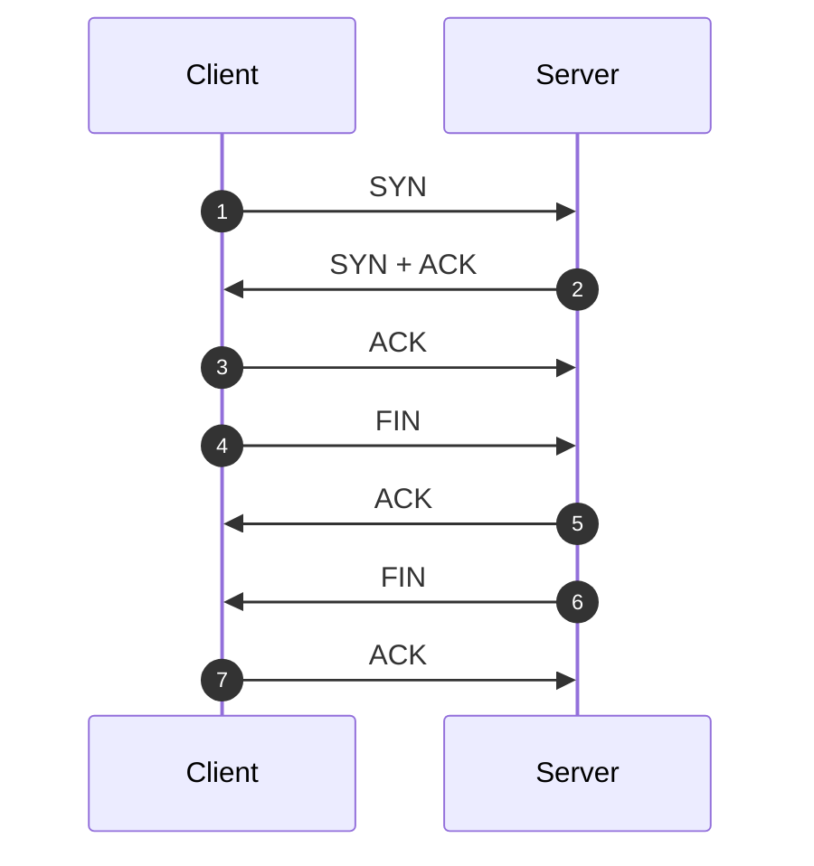

# SIECI KOMPUTEROWE

## Usługi i protokoły warstwy aplikacji na przykładzie protokołu HTTP

Warstwa aplikacji w modelu OSI lub warstwa aplikacji w modelu TCP/IP (często traktowane jako warstwy od transportowej do aplikacji w modelu OSI) odpowiada za komunikację pomiędzy aplikacjami na różnych maszynach w sieci. W skład tej warstwy wchodzą zarówno protokoły komunikacyjne, jak i usługi aplikacji wykorzystujące te protokoły.

### Usługi warstwy aplikacji

1. **Komunikacja poczty elektronicznej**: Protokoły takie jak SMTP, IMAP i POP3.
2. **Transfer plików**: FTP i TFTP.
3. **Zdalny dostęp**: Telnet, SSH.
4. **Usługi nazw**: DNS.
5. **Usługi strumieniowania multimediów**: RTSP.
6. **Usługi zarządzania siecią**: SNMP.
7. **Usługi przeglądania stron internetowych**: HTTP, HTTPS.

### Protokół HTTP

**HTTP** (Hypertext Transfer Protocol) jest protokołem warstwy aplikacji używanym do przesyłania dokumentów hipertekstowych, głównie stron internetowych. Charakteryzuje się następującymi cechami:

1. **Bezstanowość**: Każde żądanie od klienta do serwera jest traktowane jako pojedyncza transakcja. Serwer nie zachowuje żadnych danych o stanie klienta między żądaniami.
2. **Prostota**: Protokół oparty na tekstach, co sprawia, że jest czytelny dla człowieka.
3. **Rozszerzalność**: Możliwość definiowania własnych metod i nagłówków.
4. **Bezpołączenowość**: Po przesłaniu żądania i odpowiedzi połączenie jest zamykane, co oznacza, że serwer nie utrzymuje połączeń przez długi czas.

#### Podstawowe metody HTTP

-   **GET**: Pobieranie zasobów.
-   **POST**: Wysyłanie danych do serwera (np. formularzy).
-   **PUT**: Aktualizacja zasobów.
-   **DELETE**: Usuwanie zasobów.

#### Statusy odpowiedzi HTTP

-   **2xx**: Sukces (np. 200 OK, 201 Created).
-   **3xx**: Przekierowanie (np. 301 Moved Permanently).
-   **4xx**: Błąd klienta (np. 404 Not Found, 403 Forbidden).
-   **5xx**: Błąd serwera (np. 500 Internal Server Error).

Protokół HTTP stał się podstawą dla wielu aplikacji internetowych, takich jak przeglądarki internetowe, ale także dla innych usług, takich jak RESTful web services. W celu zwiększenia bezpieczeństwa transmisji wprowadzono **HTTPS** (HTTP Secure), który jest wersją HTTP działającą nad protokołem SSL/TLS.

## Usługi warstwy transportu na przykładzie protokołu TCP

Warstwa transportu w modelu OSI (lub modelu TCP/IP) ma kluczowe znaczenie dla komunikacji w sieciach komputerowych. Zapewnia komunikację międzyprocesową pomiędzy aplikacjami działającymi na różnych komputerach. Warstwa transportu gwarantuje, że dane zostaną dostarczone z jednego końca do drugiego, niezależnie od warstw sieciowych poniżej.

### Usługi warstwy transportu

1. **Multiplexing/Demultiplexing**: Pozwala na jednoczesne połączenia wielu aplikacji na jednym hoście do wielu aplikacji na zdalnym hoście.
2. **Segmentacja i reasemblacja**: Dane wysyłane przez aplikacje są dzielone na segmenty w warstwie transportowej i składane z powrotem w odpowiednim celu.
3. **Ustalanie połączeń**: Zapewnia kontrolę przepływu oraz mechanizmy kontroli błędów.
4. **Kontrola przepływu**: Mechanizmy takie jak mechanizm okienek w TCP zapobiegają przeciążeniu sieci lub zdalnego hosta.
5. **Zapewnienie niezawodności**: W przypadku niektórych protokołów, takich jak TCP, gwarantuje dostarczenie pakietów i umożliwia ich ponowne przesyłanie w przypadku błędów.

### Protokół TCP

**TCP** (Transmission Control Protocol) to jeden z głównych protokołów warstwy transportowej, który zapewnia komunikację niezawodną, ustawioną i strumieniową:

1. **Komunikacja ustawiona**: Przed przesłaniem właściwych danych TCP wymienia segmenty do nawiązania połączenia (tzw. "trzyetapowe uściski dłoni").
2. **Komunikacja niezawodna**: TCP posiada mechanizmy umożliwiające wykrywanie i ponowne przesyłanie utraconych segmentów.
3. **Kontrola przepływu**: Za pomocą mechanizmu okienek TCP zapobiega przeciążeniu zdalnego hosta lub sieci.
4. **Kontrola kolejności**: TCP gwarantuje, że dane odbierane są w takiej samej kolejności, w jakiej zostały wysłane.
5. **Terminacja połączenia**: Po zakończeniu komunikacji TCP kończy połączenie w sposób uporządkowany, aby obie strony były świadome zakończenia komunikacji.

### Flagi w TCP

-   **SYN**: Synchronizacja numerów sekwencyjnych, używana do nawiązywania połączenia.
-   **ACK**: Potwierdzenie, używane do potwierdzania odbioru segmentów.
-   **FIN**: Zakończenie połączenia.
-   **RST**: Reset połączenia.
-   **PSH**: Wymusza natychmiastowy przepływ danych do aplikacji odbierającej.
-   **URG**: Wskazuje, że dane są pilne.

Dzięki tym i wielu innym cechom TCP stało się podstawowym protokołem dla wielu aplikacji internetowych, takich jak przeglądarki internetowe, poczta e-mail, transfer plików czy zdalny dostęp.

TCP zapewnia niezawodne połączenie zorientowane na strumień między dwoma hostami. Niezawodność komunikacji jest realizowana przez ponowne wysłanie segmentu w przypadku zdarzenia timeout lub duplikatu ACK. TCP używa mechanizmu zwanego trzykrotnym potwierdzeniem (three-way handshake) do nawiązania połączenia oraz specyficznego procesu zakończenia połączenia. Warto zauważyć, że proces zakończenia połączenia wymaga czterech segmentów (w porównaniu z trzema dla trzykrotnego handshake). Jest to konieczne, ponieważ każda strona musi niezależnie potwierdzić chęć zamknięcia połączenia.

### Inicjacja połączenia

1. **SYN**:

    Inicjujący host (klient) wysyła segment z ustawioną flagą SYN do odbiorcy (serwera), prosząc o nawiązanie połączenia. W segmencie tym określa również swoją początkową liczbę sekwencyjną (np. x).

2. **SYN + ACK**:

    Odbiorca (serwer) odbiera żądanie i odpowiada segmentem z ustawionymi flagami SYN i ACK. W segmencie tym przekazuje swoją początkową liczbę sekwencyjną (np. y) i potwierdza otrzymanie poprzedniego segmentu, zwiększając liczbę sekwencyjną klienta o jeden (x + 1).

3. **ACK**:

    Inicjujący (klient) otrzymuje odpowiedź i wysyła potwierdzenie (ACK) do odbiorcy (serwera). Potwierdza on otrzymanie segmentu serwera, zwiększając jego liczbę sekwencyjną o jeden (y + 1). Po tym kroku połączenie jest uznawane za nawiązane i obie strony mogą przesyłać dane.

### Zakończenie połączenia TCP

4. **FIN**:

    Gdy jedna ze stron (klient) chce zakończyć połączenie, wysyła segment z ustawioną flagą FIN. Oznacza to, że klient skończył wysyłanie danych i chce zamknąć połączenie.

5. **ACK**:

    Druga strona (serwer) otrzymuje segment FIN i wysyła potwierdzenie (ACK) odbioru. Jednak to połączenie w jednym kierunku jest zamknięte, serwer nadal może wysyłać dane do klienta.

6. **FIN**:

    Gdy druga strona (serwer) również skończy wysyłanie danych, wysyła segment z ustawioną flagą FIN, informując, że również chce zamknąć połączenie w drugim kierunku.

7. **ACK**:

    Pierwsza strona (klient) otrzymuje segment FIN, wysyła potwierdzenie (ACK) jego odbioru. Po tym kroku połączenie w obu kierunkach jest zamknięte.

## Protokoły routingu warstwy sieci na przykładzie protokołu OSPF

Protokoły routingu warstwy sieci odpowiadają za wybór najbardziej optymalnych ścieżek w sieci dla przesyłanych danych. Istnieje wiele różnych protokołów routingu, które zostały stworzone, aby spełniać różne wymagania w różnych typach sieci. Jednym z najpopularniejszych protokołów routingu jest OSPF (Open Shortest Path First).

### Protokoły routingu warstwy sieci

Protokoły routingu można podzielić na dwa główne typy:

1. **Protokoły routingu z wektorem odległości** (np. RIP): W tym przypadku każdy router informuje swoich sąsiadów o całej sieci. Wady to między innymi ryzyko tzw. "pętli routingu".
2. **Protokoły routingu stanu łącza** (np. OSPF): W tym przypadku każdy router rozgłasza informacje o stanie swoich bezpośrednich połączeń do wszystkich innych routerów w sieci.

### Protokół OSPF (Open Shortest Path First)

**OSPF** jest protokołem routingu stanu łącza (link-state routing protocol) i jest szeroko stosowany w dużych sieciach IP, takich jak sieci przedsiębiorstw czy dostawców internetowych.

### Kluczowe cechy OSPF

-   **Działanie wewnątrz AS** (Autonomous System): OSPF jest protokołem routingu IGP (Interior Gateway Protocol), co oznacza, że jest używany głównie w obrębie jednego systemu autonomicznego.
-   **Działanie na podstawie stanu łącza**: Każdy router OSPF rozgłasza informacje o stanie swojego łącza do wszystkich innych routerów w sieci. Pozwala to na tworzenie dokładnej mapy topologii.
-   **Wykorzystanie algorytmu Dijkstry**: Do wyznaczania najkrótszej ścieżki.
-   **Skalowalność**: OSPF umożliwia podział dużej sieci na mniejsze obszary (areas), co zwiększa efektywność i skalowalność.
-   **Wsparcie dla różnych typów sieci**: OSPF może działać w sieciach o różnych topologiach, takich jak Ethernet, Frame Relay czy ATM.
-   **Odzyskiwanie po awarii**: OSPF potrafi szybko reagować na zmiany w sieci, takie jak awarie łącz.
-   **Bezpieczeństwo**: OSPF obsługuje uwierzytelnianie, co oznacza, że tylko uprawnione routery mogą uczestniczyć w rozgłaszaniu.

### Działanie OSPF

1. Kiedy router OSPF uruchamia się, odkrywa swoich sąsiadów i nawiązuje z nimi połączenie.
2. Routery wymieniają się informacjami o stanie swoich łącz.
3. Na podstawie zebranych informacji każdy router buduje bazę danych stanu łącza (Link-State Database, LSDB).
4. Następnie, korzystając z algorytmu Dijkstry, każdy router wyznacza najkrótszą ścieżkę do każdego innego routera w sieci.
5. W rezultacie każdy router posiada pełną tabelę routingu dla całej sieci.

Dzięki tym właściwościom OSPF jest niezwykle wydajnym i niezawodnym protokołem routingu, który może być stosowany w szerokim zakresie scenariuszy sieciowych.

## Usługi warstwy łącza na przykładzie protokołu Ethernet lub protokołów z rodziny 802.11 (WiFi)

Warstwa łącza danych, często nazywana warstwą łącza, jest odpowiedzialna za ramkowanie, adresowanie, kontrolę przepływu, wykrywanie i naprawę błędów oraz kontrolę dostępu do medium. W tym kontekście omówimy dwie główne technologie: Ethernet i WiFi (802.11).

### Ethernet (IEEE 802.3)

Ethernet jest najpopularniejszym standardem warstwy łącza używanym w lokalnych sieciach komputerowych (LAN). Oto główne usługi i funkcje dostarczane przez Ethernet:

-   **Ramkowanie**: Ethernet określa format ramki, który obejmuje nagłówki, dane oraz sekwencję sprawdzającą błędy.

-   **Adresowanie MAC**: Każde urządzenie w sieci Ethernet posiada unikalny, fizyczny adres MAC składający się z 48 bitów. Jest on używany do adresowania na poziomie warstwy łącza.

-   **Kontrola dostępu do medium (CSMA/CD)**: W tradycyjnych sieciach Ethernet kontrola dostępu do medium opiera się na mechanizmie "Carrier Sense Multiple Access with Collision Detection". Choć CSMA/CD jest obecnie rzadko stosowany ze względu na dominację przełączania w sieciach Ethernet, historycznie odegrał ważną rolę.

-   **Wykrywanie błędów**: Ramki Ethernet zawierają pole CRC (Cyclic Redundancy Check), które umożliwia wykrywanie błędów transmisji.

### WiFi (IEEE 802.11)

WiFi jest standardem dla sieci bezprzewodowych LAN. Dostarcza on podobne funkcje jak Ethernet, ale jest zoptymalizowany dla środowiska bezprzewodowego:

-   **Ramkowanie**: Podobnie jak w Ethernet, protokoły z rodziny 802.11 definiują format ramki, który składa się z nagłówków, danych i sumy kontrolnej.

-   **Adresowanie MAC**: Tak jak w Ethernet, adresy MAC są używane w 802.11 do identyfikacji urządzeń w sieci.

-   **Kontrola dostępu do medium (CSMA/CA)**: Ze względu na charakterystykę medium bezprzewodowego, 802.11 używa mechanizmu "Carrier Sense Multiple Access with Collision Avoidance". Jest on bardziej odpowiedni dla środowisk, w których trudno jest wykryć kolizje.

-   **Zabezpieczenia**: Protokoły z rodziny 802.11 zawierają różne mechanizmy bezpieczeństwa, takie jak WEP, WPA i WPA2, które zapewniają szyfrowanie danych i uwierzytelnianie użytkowników.

-   **Roaming**: Pozwala urządzeniom przenosić się między różnymi punktami dostępowymi w obrębie jednej sieci, zapewniając ciągłość połączenia.

-   **Kontrola mocy sygnału**: Protokoły 802.11 automatycznie dostosowują moc sygnału w zależności od warunków transmisji, co optymalizuje wydajność sieci i oszczędza energię.

Obie technologie, Ethernet i 802.11, są kluczowymi składnikami infrastruktury sieciowej we współczesnym świecie i dostarczają zestaw usług umożliwiających niezawodną komunikację między urządzeniami w sieciach LAN.

## Metody ochrony informacji stosowane w bankowości internetowej

Bankowość internetowa jest kluczowym narzędziem dla wielu ludzi na całym świecie, umożliwiającym szybki dostęp do swoich kont i przeprowadzanie różnego rodzaju transakcji finansowych online. Ze względu na jej krytyczne znaczenie i wrażliwość danych, banki stosują różne metody ochrony informacji. Oto niektóre z nich:

-   **Autentykacja wieloskładnikowa (Multi-Factor Authentication - MFA)**

    Oprócz standardowego hasła, użytkownik może zostać poproszony o podanie jednorazowego kodu wysłanego na jego telefon komórkowy lub wygenerowanego przez aplikację autentykacyjną. Może to być również biometryczne potwierdzenie tożsamości, takie jak odcisk palca lub rozpoznawanie twarzy.

-   **Certyfikaty SSL/TLS**

    Zapewniają bezpieczne połączenie pomiędzy komputerem użytkownika a serwerem banku, szyfrując przesyłane dane, co czyni je niewidocznymi dla potencjalnych atakujących.

-   **Monitorowanie transakcji**

    Systemy bankowe ciągle monitorują transakcje pod kątem nietypowych wzorców, które mogą wskazywać na podejrzane działania. W przypadku wykrycia takiej transakcji bank może zablokować konto i skontaktować się z właścicielem w celu weryfikacji.

-   **Automatyczne wylogowywanie**

    Po pewnym czasie bezczynności, sesja użytkownika jest automatycznie zamykana, chroniąc dostęp do konta w przypadku, gdy ktoś zapomni się wylogować z publicznego komputera.

-   **Firewalle i systemy wykrywania włamań (IDS)**

    Banki stosują zaawansowane firewalle i systemy IDS, aby chronić swoje serwery przed nieautoryzowanym dostępem.

-   **Regularne aktualizacje oprogramowania**

    Banki regularnie aktualizują swoje systemy, aby naprawić ewentualne luki bezpieczeństwa i zapewnić ochronę przed najnowszymi zagrożeniami.

-   **Szyfrowanie danych**

    Wszystkie wrażliwe dane, takie jak numery kont czy informacje osobiste, są szyfrowane zarówno podczas transmisji, jak i przechowywania.

-   **Edukacja klientów**

    Banki często prowadzą kampanie edukacyjne, ucząc klientów, jak bezpiecznie korzystać z bankowości internetowej, jak rozpoznać próby oszustwa i jak działać w sytuacji podejrzenia naruszenia bezpieczeństwa.

-   **Wirtualna klawiatura**

    Niektóre banki oferują wirtualne klawiatury do wprowadzania haseł, aby zapobiec przechwytywaniu klawiszy przez złośliwe oprogramowanie.

-   **Ograniczenia transakcji**

    Ustalanie dziennych limitów transakcji, co może zminimalizować straty w przypadku przejęcia konta przez oszusta.

-   **Potwierdzenie transakcji poprzez SMS**

    Wysyłanie SMS-ów z kodem potwierdzającym pewne rodzaje transakcji jako dodatkowy środek zabezpieczający.

-   **Anti-phishing**

    Banki często stosują różne mechanizmy, aby upewnić się, że ich strony internetowe nie są klonowane przez oszustów. Obejmuje to technologie anti-phishingowe oraz edukację klientów w zakresie identyfikacji prawdziwych stron internetowych banku.
